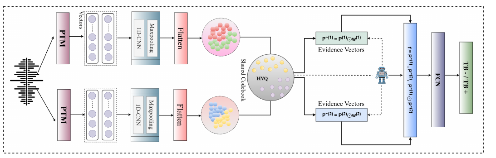

# From Signals to Patterns: Non-Invasive Tuberculosis Detection from Cough Audio using Bandit Weighted Hyperbolic Prototypes

**Mohd Mujtaba Akhtar\*, Girish\*, Sanjam Wadhwa, Muskaan Singh, Ning Ma**
*INTERSPEECH 2026 · Oral*
\* Equal contribution

[](https://arxiv.org/abs/2606.17337)


> **About this code.** This is a PyTorch re-implementation written from the paper's method section. It is **not** the original experimental code, so it will not reproduce the published numbers exactly. The paper reports few hyperparameters, so most values here are implementation choices, marked `# [impl]` in [`model.py`](model.py) and listed [below](#implementation-choices).

## Overview

Cough-based tuberculosis screening (CBTS) could make TB triage cheap and specimen-free. The paper benchmarks pretrained audio encoders and classical cepstral features for CBTS. It then shows that **fusing the two** works best: spectral features keep fine short-time detail, while foundation-model embeddings capture higher-level temporal patterns.

**COBALT** (**CO**debook-Aligned **BA**ndit-weighted hyperbo**L**ic pro**T**otyp**E** fusion) makes that fusion principled:

<p align="center"></p>

1. **Stream adaptation and tokenisation:** each stream (e.g. MFCC frames and PaSST tokens) passes through a 1-D CNN adapter and is pooled to K tokens.
2. **Hyperbolic mapping:** tokens are mapped into the Poincaré ball.
3. **Shared hyperbolic codebook:** tokens from both streams are softly assigned to one set of M prototypes, which aligns both streams in a common prototype vocabulary.
4. **Prototype evidence:** assignments are averaged into one evidence vector per stream.
5. **Bandit reliability weighting:** a multi-armed bandit keeps a score per prototype, rewarded when reweighting beats uniform weights (lower loss, larger confidence margin). Unreliable prototypes are down-weighted.
6. **Fusion:** `f = [p̃¹, p̃², p̃¹ ⊙ p̃²]` is passed to an MLP that predicts TB+ / TB−.

```
L = L_task + β_vq (L_vq¹ + L_vq²) + λ H(w)
```

## Quick start

From the repository root:

```bash
pip install -r requirements.txt

python -m papers.cobalt.train --synthetic                                  # COBALT
python -m papers.cobalt.train --synthetic --set model.geometry=euclidean   # COBALT-E
python -m papers.cobalt.train --synthetic --set model.fusion=mobius        # Möbius-addition fusion
python -m papers.cobalt.train --synthetic --model concat_cnn               # concatenation baseline
python -m papers.cobalt.train --synthetic --model cnn_probe --streams stream2   # one stream alone
```

Each run takes one to two minutes on CPU and uses participant-disjoint 5-fold cross-validation.

## Running on CODA TB

The paper uses the **CODA TB DREAM Challenge** dataset: solicited coughs from adults (≥ 18) with respiratory symptoms, collected in seven countries. It is available through Synapse (`syn31472953`) under the challenge's terms.

**1. Extract the two streams**, frame-level so COBALT can tokenise them:

```bash
python -m common.features.spectral --kind mfcc --inputs coughs.txt --out-dir data/coda/mfcc
python -m common.features.speech  --model passt --inputs coughs.txt --out-dir data/coda/passt
```

Also available: `--kind lfcc`, and speech models `wavlm`, `whisper`, `xvector`. Add `--pooled` to the spectral extractor for mean + std vectors, as used by the single-feature baselines.

**2. Write a manifest** with `subject_id,stream1,stream2,label` (label 1 = TB positive). Keep all coughs from one participant under one `subject_id`, so folds stay participant-disjoint.

**3. Train and evaluate.** Set `features` in [`configs/cobalt.yaml`](configs/cobalt.yaml) (MFCC: `dim: 40`; PaSST/WavLM: 768; Whisper/x-vector: 512), then:

```bash
python -m papers.cobalt.train --manifest data/coda/manifest.csv
```

## Published results

Results reported in the paper, from the authors' original experiments (CODA TB, five-fold CV, %).

| Model | Acc | F1 | AUC |
|---|---|---|---|
| Best single representation, PaSST (CNN head, Table 1) | 79.29 | 77.57 | 72.68 |
| Best spectral feature, MFCC (CNN head, Table 1) | 77.32 | 75.69 | 70.36 |
| Concatenation, MFCC + PaSST (Table 2) | 81.67 | 79.88 | 81.27 |
| COBALT-E (Euclidean), MFCC + PaSST (Table 2) | 85.97 | 83.54 | 85.06 |
| Möbius-addition fusion, MFCC + PaSST (Table 3) | 86.05 | 85.69 | 86.78 |
| **COBALT, MFCC + PaSST (Table 3)** | **88.93** | 87.26 | **89.07** |
| COBALT, WavLM + PaSST (Table 3) | 88.26 | **87.52** | 86.11 |

## Implementation choices

| Detail | Choice here | Why |
|---|---|---|
| Adapter `g_m` | One Conv1d(k=3)–BN–ReLU–MaxPool block to 128 channels | "Lightweight 1-D CNN adapter"; width not reported |
| Tokenise | Adaptive average pooling to K = 8 tokens | The paper allows "adaptive pooling or learnable attention pooling" |
| d_h, M, τ_q, τ_w, c | 64, 32, 0.1, 1.0, 1.0 | Not reported |
| Bandit | η = 0.1; α = β = 1; usage `u_j` = assignment mass on prototype j in the batch (max-normalised) | Follows the update rule; constants not reported |
| Baseline for the reward | Same forward pass with uniform prototype weights | The paper's example: "uniform weights" |
| Confidence margin M | Mean of p(true class) − max p(other class) | Not defined in the paper |
| `H(w)` term | `w = softmax((Q + s)/τ_w)`, where Q is the bandit buffer and s is a learnable offset | Bandit scores have no gradient; the offset lets `λ H(w)` act (λ = 0.01) |
| Evidence scaling | Evidence and weights each multiplied by M, then a LayerNorm in the head | Otherwise entries are of order 1/M² and the decision threshold drifts |
| L_vq | Codebook + commitment (0.25) in the tangent space, β_vq = 0.25 | "Stream-wise VQ loss"; weights not reported |
| Optimiser | Adam, lr 1e-3, 50 epochs, batch 32, no early stopping | Adam, epochs and batch size from the paper |

## Files

| File | Contents |
|---|---|
| [`model.py`](model.py) | COBALT model, loss and bandit update |
| [`train.py`](train.py) | Participant-disjoint 5-fold CV for COBALT and baselines |
| [`configs/cobalt.yaml`](configs/cobalt.yaml) | Hyperparameters |
| [`../../common/features/spectral.py`](../../common/features/spectral.py) | MFCC and LFCC extraction |

## Citation

```bibtex
@inproceedings{akhtar2026cobalt,
  title     = {From Signals to Patterns: Non-Invasive Tuberculosis Detection from Cough Audio using Bandit Weighted Hyperbolic Prototypes},
  author    = {Akhtar, Mohd Mujtaba and Girish and Wadhwa, Sanjam and Singh, Muskaan and Ma, Ning},
  booktitle = {Proc. Interspeech 2026},
  year      = {2026},
  eprint    = {2606.17337},
  archivePrefix = {arXiv}
}
```

## Ethics

COBALT is a research prototype for screening research. Any clinical use would need prospective validation and clinician oversight.
