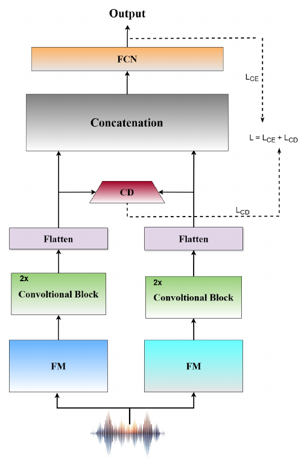

# Towards Source Attribution of Singing Voice Deepfake with Multimodal Foundation Models

**Orchid Chetia Phukan\*, Girish\*, Mohd Mujtaba Akhtar\*, Swarup Ranjan Behera, Priyabrata Mallick, Pailla Balakrishna Reddy, Arun Balaji Buduru, Rajesh Sharma**
*INTERSPEECH 2025*
\* Equal contribution

[](https://arxiv.org/abs/2506.03364)


## Overview

Singing-voice deepfakes can now copy an artist's timbre convincingly. Detecting them is not enough: for provenance and rights management we also need to know **which system generated them**. The paper introduces **singing-voice deepfake source attribution (SVDSA)** and benchmarks speech, music and multimodal foundation models for it. Multimodal models (LanguageBind, ImageBind) come out on top, which the paper attributes to their cross-modal pre-training.

**COFFE** (Fusion using **C**hern**OFF** Distanc**E**) then fuses two foundation models, using the Chernoff distance as an alignment loss:

<p align="center"></p>

1. Each foundation-model embedding passes through two conv blocks (Conv1d with 64 and 128 filters, kernel 3, max-pool 2) and is flattened.
2. The **Chernoff distance** between the two branches' feature distributions pulls the representation spaces together.
3. The branches are concatenated and passed to a dense layer of 128 units and a softmax over the source systems.

```
L = L_CE + λ · L_CD,      L_CD = −log Σ_i p_i^s · q_i^(1−s),      s = 0.3, λ = 0.1
```

## Quick start

From the repository root:

```bash
pip install -r requirements.txt

python -m papers.coffe.train --synthetic                        # COFFE on generated data (~20 s on CPU)
python -m papers.coffe.train --synthetic --model concat         # concatenation fusion (no L_CD)
python -m papers.coffe.train --synthetic --model cnn --stream fm1   # one foundation model, CNN head
python -m papers.coffe.train --synthetic --model fcn --stream fm1   # one foundation model, FCN head
```

## Running on CtrSVDD

**Data.** The paper uses the synthetic clips of **CtrSVDD** (Chinese and Japanese singing). The official train and dev splits contain the same eight systems, **A01–A08**, so train is used for training and dev for testing.

**1. Extract utterance-level embeddings** (average-pooled last hidden layer):

```bash
python -m common.features.speech --model whisper --pool --inputs ctrsvdd.txt --out-dir data/ctrsvdd/whisper
python -m common.features.speech --model xvector --pool --inputs ctrsvdd.txt --out-dir data/ctrsvdd/xvector
```

The paper's best pair, **LanguageBind (768-d) + ImageBind (1024-d)**, comes from those projects' own audio encoders; save their pooled embeddings as `.npy` vectors in the same way. Other supported extractors include `wavlm`, `wav2vec2`, `unispeech_sat`, `mms`, `xlsr_300m` and `ecapa`.

**2. Write a manifest** with `subject_id,fm1,fm2,label,split`. `label` is the source system (0–7) and `split` is `train` (CtrSVDD train) or `test` (CtrSVDD dev). Add a few `dev` rows from the training systems if you want early stopping.

**3. Train and evaluate.** Set `features.fm1.dim` / `features.fm2.dim` in [`configs/coffe.yaml`](configs/coffe.yaml), then:

```bash
python -m papers.coffe.train --manifest data/ctrsvdd/manifest.csv --protocol official
```

## Published results

Results as reported in the paper (CtrSVDD, systems A01–A08, %). Numbers from a rerun can vary slightly with feature extraction, data splits and random seeds. EER is the one-vs-all EER averaged over the eight classes.

**Single foundation models (Table 1):**

| Representation | FCN: Acc / F1 / EER | CNN: Acc / F1 / EER |
|---|---|---|
| LanguageBind | 79.69 / 77.26 / 6.98 | 82.37 / 79.80 / 5.35 |
| ImageBind | 78.50 / 74.41 / 7.54 | 81.92 / 77.90 / 6.19 |

**Fusion (Table 2), selected pairs:**

| Pair | Concatenation: Acc / F1 / EER | **COFFE**: Acc / F1 / EER |
|---|---|---|
| **LanguageBind + ImageBind** | 89.62 / 83.88 / 3.75 | **91.16 / 90.03 / 3.63** |
| x-vector + LanguageBind | 82.02 / 80.15 / 6.54 | 83.64 / 82.66 / 4.67 |
| MMS + LanguageBind | 79.05 / 75.43 / 9.75 | 83.68 / 82.27 / 9.35 |
| XLS-R + Whisper | 79.41 / 68.59 / 7.80 | 82.64 / 81.37 / 6.09 |

## Implementation notes

| Component | Setting |
|---|---|
| Inputs | Utterance-level embeddings (average-pooled last hidden layer), read as a one-channel sequence by the 1-D convolutions |
| Chernoff distance | On softmax distributions of the two branches after a linear projection to a common width of 128 (the flattened sizes differ when the two encoders differ) |
| Concatenation baseline | The same network with λ = 0 |
| Training | Adam, lr 1e-3, 50 epochs, dropout, early stopping |

## Files

| File | Contents |
|---|---|
| [`model.py`](model.py) | COFFE model and loss |
| [`train.py`](train.py) | Training and evaluation for COFFE and the single-model / concatenation baselines |
| [`configs/coffe.yaml`](configs/coffe.yaml) | Hyperparameters, with paper values marked |

## Citation

```bibtex
@inproceedings{phukan2025singing,
  title     = {Towards Source Attribution of Singing Voice Deepfake with Multimodal Foundation Models},
  author    = {Phukan, Orchid Chetia and Girish and Akhtar, Mohd Mujtaba and Behera, Swarup Ranjan and Mallick, Priyabrata and Reddy, Pailla Balakrishna and Buduru, Arun Balaji and Sharma, Rajesh},
  booktitle = {Proc. Interspeech 2025},
  year      = {2025},
  eprint    = {2506.03364},
  archivePrefix = {arXiv}
}
```
