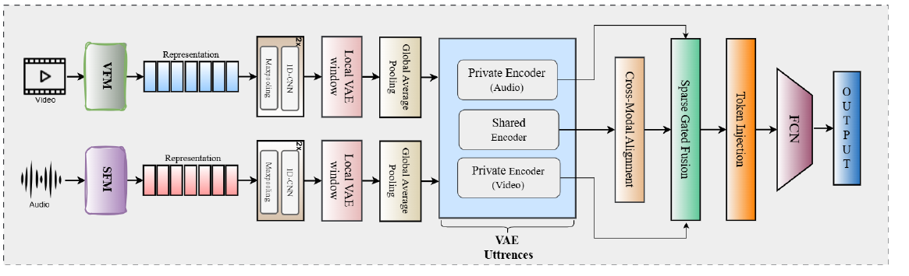

# DIVINE: Coordinating Multimodal Disentangled Representations for Oro-Facial Neurological Disorder Assessment

**Mohd Mujtaba Akhtar\*, Girish\*, Muskaan Singh**
*EACL 2026 (Main, Long Paper) · 🏆 Social Impact Award*
\* Equal contribution

[](https://aclanthology.org/2026.eacl-long.248/)
[](https://aclanthology.org/2026.eacl-long.248.pdf)


> **About this code.** This is a PyTorch re-implementation written from the paper's method section. It is **not** the original experimental code (the paper's experiments used TensorFlow), so it will not reproduce the published numbers exactly. Every place where the paper leaves a detail open is marked `# [impl]` in [`model.py`](model.py) and listed [below](#implementation-choices).

## Overview

DIVINE predicts the **diagnosis** (healthy control, ALS, post-stroke) and **severity** (mild, moderate, severe) of oro-facial neurological disorders from synchronised facial video and speech. It treats the two streams as noisy views of one underlying motor process and separates what they share from what is specific to each.

<p align="center"></p>

For each modality, frozen foundation-model features pass through:

1. **Local temporal refinement:** 1-D conv blocks over the frame sequence.
2. **Local VAE (window level):** compresses each time step; reconstruction + KL loss `L_w`.
3. **Global average pooling:** gives one utterance-level vector.
4. **Utterance-level VAE:** a *shared* encoder (weight-tied across modalities) and a *private* encoder per modality; loss `L_u`.

Across modalities:

5. **Cross-modal alignment:** decodes the video-shared latent into the audio-shared space (`L_cycle`).
6. **Sparse gated fusion:** gates computed from the private latents weigh the shared latents; L1 penalty `L_sparse`.
7. **Clinical symptom tokens:** K learnable tokens are injected alongside the fused vector and mixed by a dense layer (`L_token`).
8. **Heads:** diagnosis and severity classifiers.

```
L = L_cls + α·L_sev + ε·(L_cycle + L_sparse + ε·λ·L_token) + Σ_m (L_w + L_u)      α = 2, ε = 0.1, λ = 0.4
```

## Quick start

From the repository root:

```bash
pip install -r requirements.txt

# 1. Smoke test on generated data (no downloads, ~2–3 min on CPU)
python -m papers.divine.train --synthetic

# 2. Concatenation baseline on the same splits
python -m papers.divine.train --synthetic --model concat_cnn
```

Each run does subject-wise 5-fold cross-validation and reports accuracy, macro-F1 and severity MAE/RMSE in the paper's three test conditions: **audio + video**, **video only** and **audio only**. Results are written to `results/divine.json`. (Synthetic data is trivially separable, so the smoke test should reach ~100%; it only shows the pipeline runs end to end.)

## Running on the Toronto NeuroFace dataset

The paper uses the **Toronto NeuroFace (TNF)** dataset (Bandini et al., *IEEE JBHI* 2020): 36 participants (11 ALS, 14 post-stroke, 11 controls) performing nine speech and non-speech oro-facial tasks. It is **not public**; access must be requested from the dataset authors.

**1. Extract frozen features** (one `.npy` per recording):

```bash
python -m common.features.video  --model videomae  --inputs videos.txt --out-dir data/tnf/video
python -m common.features.speech --model trillsson --inputs audio.txt  --out-dir data/tnf/audio
```

Supported speech models: `wavlm`, `wav2vec2`, `hubert`, `whisper`, `xvector`, `trillsson`. Supported video models: `videomae`, `videomae_v2`, `vivit`. The paper's best video encoder, DeepSeek-VL2, needs its [own toolkit](https://github.com/deepseek-ai/DeepSeek-VL2); save its vision-encoder outputs as `(frames, dim)` arrays and they work the same way.

**2. Write a manifest** `data/tnf/manifest.csv`:

```csv
subject_id,video,audio,diagnosis,severity
P01,video/P01_task1.npy,audio/P01_task1.npy,0,1
...
```

`diagnosis`: 0 = HC, 1 = ALS, 2 = Stroke. `severity`: 0 = mild, 1 = moderate, 2 = severe. Paths are relative to the manifest.

**3. Set feature sizes and train.** Edit `features:` in [`configs/divine.yaml`](configs/divine.yaml) to your extractors' output dimensions, then:

```bash
python -m papers.divine.train --manifest data/tnf/manifest.csv
```

To run the Table 5 ablations, set one of `use_cycle`, `use_sparse` or `use_token_loss` to `false` in the config.

## Published results

Results reported in the paper (TNF, subject-wise 5-fold CV, %). These come from the authors' original experiments, not from this re-implementation.

**Best configurations (Table 3):** video + speech foundation models fused with DIVINE.

| Video FM + Speech FM | Test condition | Acc ↑ | F1 ↑ | RMSE ↓ | MAE ↓ |
|---|---|---|---|---|---|
| DeepSeek-VL2 + TRILLsson | audio + video | **98.26** | **97.51** | **1.93** | **1.12** |
| DeepSeek-VL2 + TRILLsson | video only | 89.27 | 88.23 | 5.02 | 3.44 |
| DeepSeek-VL2 + TRILLsson | audio only | 84.34 | 83.20 | 4.80 | 3.31 |
| VideoMAE V2 + x-vector | audio + video | 96.41 | 95.68 | 2.16 | 1.51 |

**Against simpler models (DeepSeek-VL2 + TRILLsson where fused):**

| Model | Acc ↑ | F1 ↑ |
|---|---|---|
| Best single video FM, DeepSeek-VL2 (CNN, Table 1) | 88.94 | 86.57 |
| Best single speech FM, TRILLsson (CNN multitask, Table 1) | 90.51 | 88.69 |
| Concatenation fusion (Table 2) | 94.65 | 93.87 |
| **DIVINE** | **98.26** | **97.51** |

**Ablations (Tables 5 and 6):**

| Variant | Acc ↑ | F1 ↑ | MAE ↓ | RMSE ↓ |
|---|---|---|---|---|
| DIVINE (full) | **98.26** | **97.51** | **1.12** | **1.93** |
| w/o cycle-consistency loss | 96.14 | 94.95 | 1.68 | 2.37 |
| w/o sparse gating | 95.83 | 94.21 | 1.84 | 2.65 |
| w/o token reconstruction loss | 95.62 | 93.89 | 1.90 | 2.71 |
| Single-level latent fusion | 95.22 | 93.80 | 1.85 | 2.62 |
| Flat fusion (no bottleneck) | 93.87 | 92.10 | 2.11 | 2.88 |

## Implementation choices

The paper does not specify the following, so this implementation makes these choices:

| Detail | Choice here | Why |
|---|---|---|
| Framework | PyTorch | The original used TensorFlow |
| Loss reductions | Mean over feature dims for every reconstruction, KL, cycle and L1 term | With summed terms the VAE priors dominated and the shared latents collapsed in testing |
| `β_s`, `β_p` | 1.0 | Not reported |
| KL schedule | Linear warm-up over 300 steps | Avoids posterior collapse early in training |
| Conv blocks in local refinement | 2 | Figure 2 marks the block "2×"; the text describes one |
| `Dense(S)` over `[T_1…T_K, h_fused]` | One dense layer over the flattened sequence, with LayerNorm in front | A per-row dense layer would leave `h_fused` unaffected by the tokens |
| `L_token` | Reconstruct `h_fused` from pooled token outputs + token decorrelation | Paper names it only as "token specialisation / reconstruction" |
| Severity target | 3-class softmax head; MAE/RMSE from the expected class index | Paper describes a softmax severity head |
| Missing modality | Its input is zeroed and its fusion gate set to 0; optional modality dropout (p = 0.2) in training | Supports the video-only and audio-only test conditions |
| Early stopping | Patience 15 on validation `L_cls + α·L_sev` | The paper uses early stopping but gives no criterion |
| Latent sizes | `d' = 128`, `d_w = 64`, `d_s = 64`, `K = 8` | Not reported |

If you have the original values for any of these, update [`configs/divine.yaml`](configs/divine.yaml).

## Files

| File | Contents |
|---|---|
| [`model.py`](model.py) | DIVINE model and loss |
| [`train.py`](train.py) | Cross-validation training and evaluation (DIVINE and concatenation baselines) |
| [`configs/divine.yaml`](configs/divine.yaml) | Hyperparameters, with paper values marked |
| [`../../tests/test_divine.py`](../../tests/test_divine.py) | Unit tests: shapes, gradients, missing-modality behaviour, learning a separable signal |

## Citation

```bibtex
@inproceedings{akhtar-etal-2026-divine,
    title     = "{DIVINE}: Coordinating Multimodal Disentangled Representations for Oro-Facial Neurological Disorder Assessment",
    author    = "Akhtar, Mohd Mujtaba and Girish and Singh, Muskaan",
    booktitle = "Proceedings of the 19th Conference of the European Chapter of the Association for Computational Linguistics (Volume 1: Long Papers)",
    year      = "2026",
    publisher = "Association for Computational Linguistics",
    url       = "https://aclanthology.org/2026.eacl-long.248/",
    pages     = "5379--5392"
}
```

## Ethics

TNF contains clinical recordings used under institutional approvals. DIVINE is a research prototype for decision support. It is not clinically validated and must not be used for diagnosis without clinician oversight.
