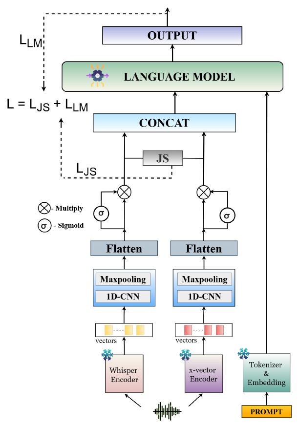

# Bridging the SEA Gap: An Initial Benchmark for Neural Audio Codec-Synthesized Speech Deepfakes in South-East Asian Languages

**Orchid Chetia Phukan\*, Girish\*, Mohd Mujtaba Akhtar\*, Arun Balaji Buduru**
*IJCAI 2026*
\* Equal contribution as first co-authors

[](https://arxiv.org/abs/2606.15968)
[](https://helixometry.github.io/SEACodecFake/)


## Overview

Codec-fake (CF) speech, resynthesised by neural audio codecs, had not been studied for South-East Asian (SEA) languages, even though the region relies heavily on voice in digital banking and e-governance. The paper contributes:

1. **SEA-CF**, a CF benchmark for **Tamil, Hindi, Thai, Indonesian, Malay and Vietnamese**, built from Common Voice, GigaSpeech2, the Thai Dialect Corpus, VIVOS, Malay corpora and IndicSUPERB.
2. **GARUDA**, a **small audio-language model** (under 1B parameters in total) that outperforms fine-tuned 7B audio-language models; GARUDA-FT averages 1.21 s per test utterance against 12.32 s for fine-tuned Qwen2-Audio-Base.

<p align="center"></p>

1. A semantic representation (**Whisper** encoder) and a prosodic / speaker representation (**x-vector**) each pass a conv module (Conv1d, kernel 3, max-pool), are flattened and filtered by a **sigmoid gate**.
2. **Jensen–Shannon alignment:** both are turned into temperature-scaled feature distributions, `p_x = softmax(x/τ)`, `p_y = softmax(y/τ)`, and `L_JS = ½ KL(p_x ‖ m) + ½ KL(p_y ‖ m)` with `m = ½(p_x + p_y)`.
3. The two are concatenated, passed through a fully connected layer of **90 neurons** and projected into the LM embedding space as a **continuous prefix** for **Qwen2-0.5B**, followed by the prompt *'Is the speech sample fake or real? Reply in one word "fake" or "real".'*

```
L_total = L_LM + λ · L_JS,      τ = 0.5, λ = 0.4
```

Two training formats: **GARUDA** trains only the projection module (conv blocks, gates, fully connected layer, prefix projection) with the LM frozen; **GARUDA-FT** also trains **LoRA** adapters (rank 8, α = 32) on the LM's query and value projections.

## Quick start

From the repository root:

```bash
pip install -r requirements.txt

python -m papers.garuda.train --synthetic                         # GARUDA with a tiny offline LM (~10 s on CPU)
python -m papers.garuda.train --synthetic --model concat          # Wh + XV (Concat): concatenation without JS
python -m papers.garuda.train --synthetic --model kl              # Wh + XV (KL): KL instead of JS
python -m papers.garuda.train --synthetic --model single --stream whisper   # Only Wh
python -m papers.garuda.train --synthetic --config papers/garuda/configs/garuda_ft.yaml   # GARUDA-FT
```

`--synthetic` swaps Qwen2 for a tiny randomly initialised causal LM so the test runs offline. A random LM has no language knowledge to steer, so the smoke test also adds LoRA adapters to it.

## Running on SEA-CF and CodecFake

**Data.** GARUDA is trained on the combined training splits of **CodecFake** (English and Chinese, both spoken in Singapore) and **SEA-CF**, selected on their validation splits and tested on their test splits. SEA-CF uses an 8:1:1 split (IndicSUPERB's official split for Tamil and Hindi). Test setting (i) uses codecs seen in training; setting (ii) uses unseen codecs.

**1. Extract utterance-level embeddings** (512-d each):

```bash
python -m common.features.speech --model whisper --pool --inputs sea_cf.txt --out-dir data/sea_cf/whisper
python -m common.features.speech --model xvector --pool --inputs sea_cf.txt --out-dir data/sea_cf/xvector
```

**2. Write a manifest** with `subject_id,whisper,xvector,label,split` (label 1 = codec fake).

**3. Train and evaluate** (downloads `Qwen/Qwen2-0.5B` from the Hugging Face Hub):

```bash
python -m papers.garuda.train --manifest data/sea_cf/manifest.csv                                       # GARUDA
python -m papers.garuda.train --manifest data/sea_cf/manifest.csv --config papers/garuda/configs/garuda_ft.yaml   # GARUDA-FT
```

The detection score for EER is `log p("fake") − log p("real")`.

## Published results

Results as reported in the paper (accuracy / EER, %). Numbers from a rerun can vary slightly with feature extraction, data splits and random seeds. Wh = Whisper, XV = x-vector.

**Seen codecs (Table 1):**

| Model | SEA-CF | CodecFake | Average |
|---|---|---|---|
| AASIST | 86.98 / 15.74 | 93.09 / 8.16 | 90.04 / 11.95 |
| MiO | 88.76 / 12.51 | 95.64 / 6.37 | 92.20 / 9.44 |
| SeaLLMs-Audio-7B, fine-tuned | 88.74 / 9.64 | 90.75 / 6.96 | 89.75 / 8.30 |
| Qwen2-Audio-Base, fine-tuned | 93.88 / 6.95 | 95.06 / 4.21 | 94.47 / 5.58 |
| GARUDA: only Wh | 89.58 / 11.72 | 90.12 / 7.53 | 89.85 / 9.63 |
| GARUDA: only XV | 90.99 / 10.43 | 93.15 / 7.28 | 92.07 / 8.86 |
| GARUDA: Wh + XV (Concat) | 91.56 / 9.17 | 94.88 / 7.16 | 93.22 / 8.17 |
| GARUDA: Wh + XV (CA) | 93.62 / 7.04 | 95.10 / 6.41 | 94.36 / 6.73 |
| GARUDA: Wh + XV (KL) | 90.83 / 9.31 | 93.46 / 6.68 | 92.15 / 8.00 |
| **GARUDA** | **94.37 / 6.26** | **97.00 / 4.19** | **95.69 / 5.23** |
| GARUDA-FT: Wh + XV (Concat) | 93.78 / 8.24 | 95.40 / 4.38 | 94.59 / 6.31 |
| GARUDA-FT: Wh + XV (CA) | 96.07 / 5.82 | 97.26 / 5.49 | 96.67 / 5.66 |
| **GARUDA-FT** | **98.41 / 2.78** | **99.36 / 1.68** | **98.89 / 2.23** |

Zero-shot, Qwen2-Audio-Base reaches only 8.41 / 91.53 on SEA-CF.

**Unseen codecs (Table 2):**

| Model | SEA-CF | CodecFake | Average |
|---|---|---|---|
| MiO | 85.55 / 13.91 | 93.44 / 7.77 | 88.50 / 10.84 |
| Qwen2-Audio-Base, fine-tuned | 92.08 / 8.15 | 93.26 / 5.42 | 92.67 / 6.79 |
| **GARUDA** | 92.97 / 6.88 | 94.60 / 5.71 | 93.79 / 6.30 |
| **GARUDA-FT** | **97.11 / 3.17** | **98.06 / 2.23** | **97.59 / 2.70** |

## Implementation notes

| Component | Setting |
|---|---|
| Conv module | One Conv1d (32 filters, kernel 3) + max-pool over the pooled embedding |
| Gate | Element-wise sigmoid gate on the flattened features, computed by a 1×1 convolution over the conv feature map |
| Concat ablation | Same network without the JS loss |
| JS alignment | On the flattened gated features (equal sizes for Whisper-base and x-vector; with encoders of different sizes, both are linearly projected to a common width first) |
| Prefix | The 90-unit layer is projected to 4 prefix tokens of the LM's hidden size |
| Answer scoring | Log-likelihood of "real" / "fake" given the prefix and prompt; `L_LM` is the negative log-likelihood of the correct answer |
| GARUDA | AdamW, lr 1e-4, batch 32, 5 epochs, dropout ([`configs/garuda.yaml`](configs/garuda.yaml)) |
| GARUDA-FT | LoRA rank 8, α = 32 on `q_proj` / `v_proj`; AdamW, lr 1e-5, batch 32, 3 epochs ([`configs/garuda_ft.yaml`](configs/garuda_ft.yaml)) |

The cross-attention ablation (CA) is reported above for completeness but is not included as a switch here.

## Files

| File | Contents |
|---|---|
| [`model.py`](model.py) | GARUDA model and loss |
| [`train.py`](train.py) | Training and evaluation on the official splits |
| [`configs/garuda.yaml`](configs/garuda.yaml), [`configs/garuda_ft.yaml`](configs/garuda_ft.yaml) | GARUDA and GARUDA-FT hyperparameters |
| [`../../common/alm.py`](../../common/alm.py) | Prefix-LM head (Hugging Face causal LMs or the offline toy LM), LoRA |

## Citation

```bibtex
@inproceedings{phukan2026seagap,
  title     = {Bridging the {SEA} Gap: An Initial Benchmark for Neural Audio Codec-Synthesized Speech Deepfakes in South-East Asian Languages},
  author    = {Phukan, Orchid Chetia and Girish and Akhtar, Mohd Mujtaba and Buduru, Arun Balaji},
  booktitle = {Proceedings of the International Joint Conference on Artificial Intelligence (IJCAI)},
  year      = {2026},
  eprint    = {2606.15968},
  archivePrefix = {arXiv}
}
```

## Ethics

SEA-CF and GARUDA are built for defensive research against codec-based speech manipulation. The source corpora keep their original licences. A detector's output is not proof about a recording on its own.
