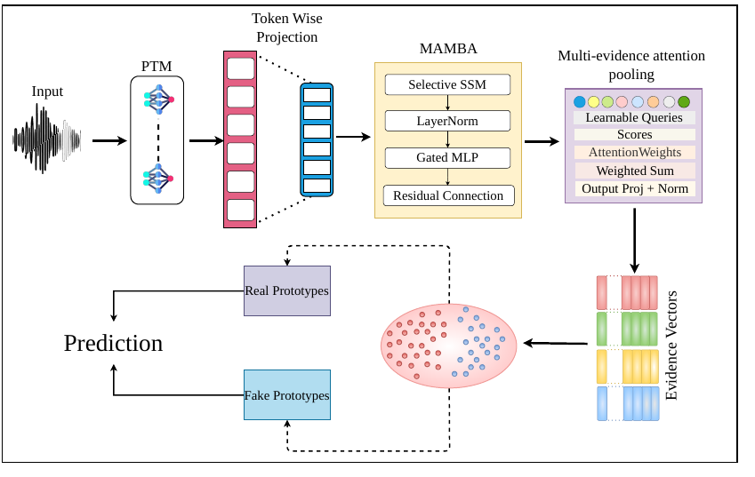

# HCFD: A Benchmark for Audio Deepfake Detection in Healthcare

**Mohd Mujtaba Akhtar\*, Girish\*, Muskaan Singh**
*Findings of ACL 2026*
\* Equal contribution

[](https://aclanthology.org/2026.findings-acl.1739/)
[](https://arxiv.org/abs/2604.17642)
[](https://helixometry.github.io/HCFD/)


> **About this code.** This is a PyTorch re-implementation of **PHOENIX-Mamba**, written from Section 4.2 and Appendix B. It is **not** the original experimental code, so it will not reproduce the published numbers exactly. Every detail the paper leaves open is marked `# [impl]` in [`model.py`](model.py) and listed [below](#implementation-choices). The Healthcare CodecFake dataset itself is not included.

## Overview

Clinical voice recordings are both a health signal and an identity signal, which makes them an attractive target for codec-generated deepfakes. Pathological speech changes prosody, articulation and phonation, and those changes can hide the traces that codec-fake detectors rely on.

The paper contributes:

1. **Healthcare CodecFake (HCFK)**, the first pathology-aware codec-fake dataset. Bona fide clinical speech is resynthesised through seven neural audio codec families, covering depression, Alzheimer's disease and dysarthria in English and Chinese.
2. **A benchmark** of existing detectors and pretrained encoders on HCFK. Detectors trained on healthy speech drop to near chance.
3. **PHOENIX-Mamba**, a geometry-aware detector that keeps several local pieces of evidence per utterance and models codec fakes as **several self-discovered modes** in hyperbolic space.

<p align="center"></p>

**PHOENIX-Mamba** (**P**rototypical **H**yperbolic **O**rganization for **E**vidence **N**ormalization and **I**nference using e**X**ponential-map):

1. A **token-wise adapter** maps frozen encoder frames to width d = 256.
2. A **Mamba (selective state-space) backbone** adds long-range temporal context.
3. **Multi-evidence attention pooling:** M = 4 learnable queries each attend over time, giving M evidence vectors instead of one pooled vector, since codec artefacts can be local and intermittent.
4. Evidence vectors are mapped into the **Poincaré ball**. There is one **real prototype** and K = 4 **fake-mode prototypes**. The real score is `−d(h, p₋)`; the fake score is a soft-min over the fake modes.
5. **Losses:** cross-entropy, plus a clustering loss that pulls fake evidence to its assigned mode (with an entropy term), plus a separation loss that keeps prototypes apart.

```
L = L_cls + λ L_cluster + β L_sep          λ = 1.0, β = 0.1, γ = 0.05 (entropy)
```

## Quick start

From the repository root:

```bash
pip install -r requirements.txt

python -m papers.hcfd.train --synthetic                          # PHOENIX-Mamba (small smoke config)
python -m papers.hcfd.train --synthetic --model cnn_probe        # CNN probe baseline
python -m papers.hcfd.train --synthetic --unseen-codecs snac,dac # seen / unseen codec protocol
```

`--synthetic` uses [`configs/phoenix_smoke.yaml`](configs/phoenix_smoke.yaml), a scaled-down model that runs in under a minute on CPU. Real runs use the paper's sizes in [`configs/phoenix.yaml`](configs/phoenix.yaml).

## Running on HCFK

**Source corpora** (each from its custodian, under its own licence):

| Condition | English | Chinese |
|---|---|---|
| Depression | DAIC-WOZ | EATD-Corpus |
| Alzheimer's | ADReSS / ADReSSo | NCMMSC |
| Dysarthria | TORGO | CDSD |

**Codecs:** SpeechTokenizer, DAC (16/24/44 kHz), EnCodec (24/48 kHz), SoundStream (16 kHz), FunCodec, AudioDec (28/48 kHz) and SNAC (24/32/44 kHz). Each bona fide utterance gets one resynthesised copy per codec, within the official speaker-disjoint train/dev/test splits. Appendix A of the paper lists the exact checkpoints.

**1. Extract frame-level features** (the paper's best encoder is PaSST):

```bash
python -m common.features.speech --model wavlm --inputs en_dep.txt --out-dir data/hcfk/en_dep/wavlm
```

Supported: `wavlm`, `wav2vec2`, `whisper`, `xvector`, `passt`.

**2. Write one manifest per condition and language** with `subject_id,features,label,split,codec`. Use label 1 = codec-fake, `split` ∈ {train, dev, test} and `codec` = the codec family, or `bonafide`.

**3. Train and evaluate.** Set `features.dim` in [`configs/phoenix.yaml`](configs/phoenix.yaml) (768 for WavLM/wav2vec 2.0/PaSST, 512 for Whisper/x-vector), then:

```bash
python -m papers.hcfd.train --manifest data/hcfk/en_dep/manifest.csv
python -m papers.hcfd.train --manifest data/hcfk/en_dep/manifest.csv --unseen-codecs funcodec,snac
```

Accuracy and macro-F1 use a decision threshold chosen on dev; EER and AUC are threshold-free. **Ablations (Table 5)** are config switches: `--set model.backbone=bigru` (or `cnn`), `--set model.num_evidence=1`, `--set model.geometry=euclidean` (PHOENIX-Euc).

## Published results

Results reported in the paper, from the authors' original experiments (accuracy / macro-F1, %).

**Detectors trained on standard CodecFake fail on clinical speech (Table 1, AASIST, English):** Dep 48.62 / 44.03, Alz 34.19 / 32.51, Dys 36.71 / 34.39.

**PaSST features: CNN head vs PHOENIX-Mamba (Tables 2 and 3):**

| Language | Condition | CNN head | **PHOENIX-Mamba** | EER: CNN → PHOENIX |
|---|---|---|---|---|
| English | Depression | 78.98 / 76.62 | **97.04 / 96.81** | 14.01 → **5.17** |
| English | Alzheimer's | 67.94 / 65.27 | **96.73 / 95.20** | 16.52 → **6.29** |
| English | Dysarthria | 71.03 / 70.54 | **96.57 / 94.28** | 15.93 → **6.23** |
| Chinese | Depression | 75.69 / 72.19 | **94.41 / 92.10** | 18.42 → **6.54** |
| Chinese | Alzheimer's | 65.71 / 64.24 | **94.40 / 92.18** | 20.04 → **5.42** |
| Chinese | Dysarthria | 67.36 / 65.02 | **93.20 / 91.42** | 21.78 → **6.79** |

**Unseen codec families (Table 4, PaSST):** five codec families in training, two held out for test. English: 95.59 / 93.29 (Dep), 94.66 / 92.04 (Alz), 95.17 / 93.28 (Dys). Chinese: 94.17 / 93.74, 95.09 / 92.75, 93.99 / 93.02.

**Ablations (Table 5, English, PaSST):**

| Variant | Dep | Alz | Dys |
|---|---|---|---|
| CNN head | 82.26 / 80.73 | 75.52 / 72.13 | 79.37 / 77.91 |
| BiGRU head | 87.69 / 84.91 | 82.86 / 80.49 | 86.61 / 83.73 |
| Single evidence (M = 1) | 73.51 / 72.02 | 55.03 / 52.67 | 67.94 / 65.02 |
| PHOENIX-Euc | 83.62 / 81.24 | 79.48 / 77.16 | 84.72 / 83.67 |
| **PHOENIX-Mamba (full)** | **97.04 / 94.81** | **96.73 / 94.20** | **96.05 / 93.28** |

## Implementation choices

| Detail | Choice here | Why |
|---|---|---|
| Mamba backbone | 2 pre-norm blocks (selective SSM → LayerNorm → gated MLP, residual), state size 16, pure PyTorch | Figure 1 shows the block; depth and state size not reported. The scan is sequential, so use a GPU for real runs |
| Evidence pooling | M learnable queries; scaled dot-product scores over time; output projection + LayerNorm | Follows Figure 1 |
| Fake score `s₊` | `τ · logsumexp(−d/τ)` | The paper's formula omits the τ factor, which would put `s₊` on a 1/τ larger scale than `s₋` |
| `L_cluster` | Applied to fake samples only | It pulls evidence toward the fake modes, which would contradict the classifier for real speech |
| Tangent clipping | Norm ≤ 1 before the exponential map | Otherwise points saturate at the ball boundary and training stalls |
| Checkpoint | Best dev cross-entropy within the 20 epochs | Not specified |
| Encoders | Frozen, with features pre-extracted | The paper also keeps WavLM, wav2vec 2.0 and Whisper frozen |

## Files

| File | Contents |
|---|---|
| [`model.py`](model.py) | PHOENIX-Mamba model and losses |
| [`train.py`](train.py) | Training and evaluation on official splits, seen/unseen codec protocol, probe baselines |
| [`configs/phoenix.yaml`](configs/phoenix.yaml) | Paper hyperparameters (Appendix B) |
| [`configs/phoenix_smoke.yaml`](configs/phoenix_smoke.yaml) | Small configuration for the CPU smoke test |
| [`../../common/mamba.py`](../../common/mamba.py) | Dependency-free Mamba block |

## Citation

```bibtex
@inproceedings{akhtar-etal-2026-hcfd,
  title     = {{HCFD}: A Benchmark for Audio Deepfake Detection in Healthcare},
  author    = {Akhtar, Mohd Mujtaba and Girish and Singh, Muskaan},
  booktitle = {Findings of the Association for Computational Linguistics: ACL 2026},
  year      = {2026},
  publisher = {Association for Computational Linguistics},
  url       = {https://aclanthology.org/2026.findings-acl.1739/}
}
```

## Ethics

HCFK is built to support defensive research against codec-generated manipulation of healthcare speech. The source corpora keep their original licences and consent conditions. Neither the models nor the benchmark are intended for diagnosis or as a standalone security control.
