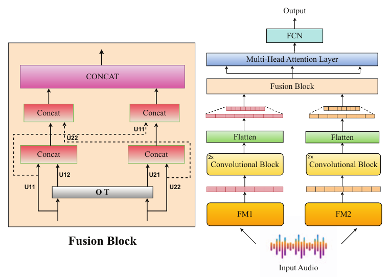

# Strong Alone, Stronger Together: Synergizing Modality-Binding Foundation Models with Optimal Transport for Non-Verbal Emotion Recognition

**Orchid Chetia Phukan, Mohd Mujtaba Akhtar\*, Girish\*, Swarup Ranjan Behera, Sishir Kalita, Arun Balaji Buduru, Rajesh Sharma, S. R. Mahadeva Prasanna**
*ICASSP 2025*
\* Equal contribution

[](https://ieeexplore.ieee.org/abstract/document/10889257)


## Overview

Non-verbal vocalisations (laughs, cries, sighs, screams) carry emotion without words. The paper's hypothesis is that **multimodal foundation models** (MFMs) such as LanguageBind and ImageBind, pre-trained to bind audio with images, text and other modalities, interpret these subtle cues better than audio-only foundation models. Benchmarks on three non-verbal emotion datasets support this: LanguageBind is the strongest single representation.

**MATA** (Intra-**M**odality **A**lignment through **T**ransport **A**ttention) then fuses two foundation models:

<p align="center"></p>

1. Each embedding passes through two conv blocks (Conv1d with 32 and 64 filters, kernel 3, max-pool), is flattened and projected to 120 dimensions (`x1`, `x2`).
2. **Optimal transport:** `M = ‖x1 − x2‖₂ / max`, `γ = Sinkhorn(M)`, `x2→x1 = γ·x2`, `x1→x2 = γᵀ·x1`.
3. `fused1 = [x2→x1, x1]` and `fused2 = [x1→x2, x2]`; each is concatenated with the **opposite** model's features, `[fused1, x2]` and `[fused2, x1]`.
4. Everything is concatenated and refined by **multi-head attention** (8 heads), then a fully connected network predicts the emotion.

## Quick start

From the repository root:

```bash
pip install -r requirements.txt

python -m papers.mata.train --synthetic                          # MATA on generated data (~20 s on CPU)
python -m papers.mata.train --synthetic --set model.use_mha=false    # "Fusion with OT" (no attention)
python -m papers.mata.train --synthetic --model concat           # concatenation fusion
python -m papers.mata.train --synthetic --model cnn --stream fm1     # one foundation model, CNN head
```

## Running on the paper's datasets

**Datasets.** **ASVP-ESD** (non-speech part only), **JNV** (Japanese non-verbal vocalisations, 6 emotions) and **VIVAE** (6 emotions), plus **CREMA-D** (speech, 6 emotions) as an additional benchmark. 5-fold cross-validation.

**1. Extract utterance-level embeddings** (average-pooled last hidden layer, 16 kHz audio):

```bash
python -m common.features.speech --model unispeech_sat --pool --inputs jnv.txt --out-dir data/jnv/unispeech_sat
python -m common.features.speech --model wavlm         --pool --inputs jnv.txt --out-dir data/jnv/wavlm
```

Also supported: `wav2vec2`. **LanguageBind** (768-d) and **ImageBind** (1024-d) audio embeddings come from those projects' own encoders; save them pooled as `.npy` vectors.

**2. Write a manifest** with `subject_id,fm1,fm2,label`.

**3. Train and evaluate.** Set `features` and `num_classes` in [`configs/mata.yaml`](configs/mata.yaml), then:

```bash
python -m papers.mata.train --manifest data/jnv/manifest.csv
```

## Published results

Results as reported in the paper (accuracy / macro-F1, %, average of five folds; Table I). Numbers from a rerun can vary slightly with feature extraction, data splits and random seeds. LB = LanguageBind, IB = ImageBind.

| Model | ASVP-ESD | JNV | VIVAE | CREMA-D |
|---|---|---|---|---|
| LB alone (CNN) | 75.55 / 67.55 | 73.65 / 72.51 | 69.12 / 68.83 | 63.67 / 63.26 |
| IB alone (CNN) | 62.03 / 49.11 | 63.10 / 60.97 | 55.30 / 54.63 | 63.67 / 63.68 |
| LB + IB, concatenation | 76.34 / 64.58 | 72.62 / 72.26 | 67.48 / 67.28 | 71.46 / 71.71 |
| LB + IB, fusion with OT (no attention) | 76.41 / 68.79 | 77.03 / 76.14 | 70.05 / 69.80 | 62.12 / 62.05 |
| **LB + IB, MATA** | **76.47 / 70.35** | **77.40 / 76.19** | **75.12 / 74.63** | **72.64 / 72.62** |

With audio-only models, MATA also improves over concatenation, e.g. UniSpeech-SAT + WavLM 56.66 / 46.55 on ASVP-ESD (concatenation 53.61 / 38.98).

## Implementation notes

| Component | Setting |
|---|---|
| Inputs | Utterance-level embeddings, read as a one-channel sequence by the 1-D convolutions |
| Optimal transport | Across the rows of each mini-batch with uniform marginals; Sinkhorn with ε = 0.05 on the max-normalised cost; barycentric transported features |
| Attention | The six 120-d vectors `[x2→x1, x1, x2, x1→x2, x2, x1]` are the tokens of an 8-head attention layer (residual connection and layer norm) |
| Fully connected network | One dense layer of 128 units before the output |
| Single-model baseline | Conv1d 64 and 128 filters, dense layer of 128 units |
| Training | Adam, lr 1e-3, batch 32, 50 epochs, cross-entropy, dropout, early stopping |

## Files

| File | Contents |
|---|---|
| [`model.py`](model.py) | MATA model |
| [`train.py`](train.py) | 5-fold CV for MATA and the baselines |
| [`configs/mata.yaml`](configs/mata.yaml) | Hyperparameters, with paper values marked |

## Citation

```bibtex
@inproceedings{phukan2025strong,
  title     = {Strong Alone, Stronger Together: Synergizing Modality-Binding Foundation Models with Optimal Transport for Non-Verbal Emotion Recognition},
  author    = {Phukan, Orchid Chetia and Akhtar, Mohd Mujtaba and Girish and Behera, Swarup Ranjan and Kalita, Sishir and Buduru, Arun Balaji and Sharma, Rajesh and Prasanna, S. R. Mahadeva},
  booktitle = {IEEE International Conference on Acoustics, Speech and Signal Processing (ICASSP)},
  year      = {2025},
  doi       = {10.1109/ICASSP49660.2025.10889257}
}
```
