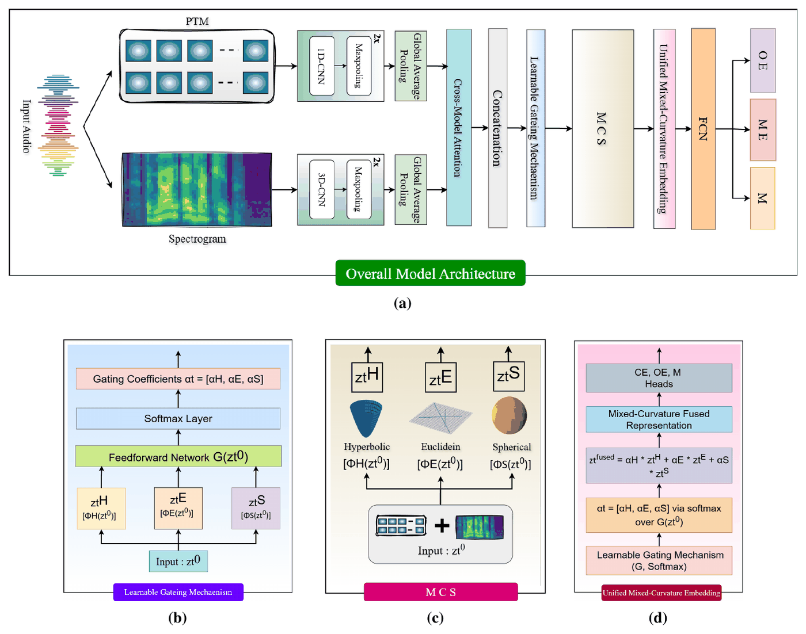

# MiCuNet: Towards Attribution of Generators and Emotional Manipulation in Cross-Lingual Synthetic Speech using Geometric Learning

**Girish\*, Mohd Mujtaba Akhtar\*, Farhan Sheth, Muskaan Singh**
*Findings of IJCNLP-AACL 2025*
\* Equal contribution

[](https://aclanthology.org/2025.findings-ijcnlp.37/)


## Overview

Emotional voice conversion (EVC) can change the emotion of real speech while keeping the speaker's identity. Tracing such manipulation needs three answers at once: the **original emotion (OE)**, the **current, manipulated emotion (CE)** and the **manipulation source (M)**, i.e. which EVC model was used. The paper shows that multilingual speech foundation models, combined with hand-crafted spectrogram features, work best, and proposes a multitask framework that fuses them in mixed-curvature space.

**MiCuNet** (**Mi**xed-**Cu**rvature **Net**work):

<p align="center"></p>

1. **Encoders:** a speech foundation-model embedding goes through a 1-D CNN; a spectrogram (e.g. STFT + mel filterbank) goes through a 3-D CNN (three blocks, 32 → 64 → 128 channels, 3×3×3 convolutions, batch norm, ReLU, 2×2×2 max-pool).
2. **Attention:** self-attention inside each modality, then bidirectional cross-modal attention; the pooled outputs are concatenated into `z0`.
3. **Mixed-curvature projection:** shared non-linear maps project `z0` onto the **Poincaré ball** (hyperbolic), **Euclidean** space and the **unit sphere**; log maps bring each back to a tangent space.
4. **Learnable gating:** a feed-forward network with a softmax weights the three spaces, `z_fused = Σ_k w_k · log_k(z_k)`.
5. **Multitask heads** for OE, CE and M (hidden layer + ReLU + softmax each); the loss is the sum of the three cross-entropies.

## Quick start

From the repository root:

```bash
pip install -r requirements.txt

python -m papers.micunet.train --synthetic                                   # English -> English / Chinese
python -m papers.micunet.train --synthetic --set "model.spaces=[euclidean]"  # only Euclidean
python -m papers.micunet.train --synthetic --set "model.spaces=[euclidean,spherical]"   # without hyperbolic
python -m papers.micunet.train --synthetic --set model.gating=uniform        # no learnable gating
python -m papers.micunet.train --synthetic --model concat                    # concatenation fusion
python -m papers.micunet.train --synthetic --unseen-sources evc5,evc6        # unseen EVC models
```

## Running on EmoFake

**Dataset.** **EmoFake** (English and Chinese; 10 speakers each; five emotions: neutral, happy, angry, sad, surprise). Fake speech comes from seven EVC models: VAW-GAN-CWT, DeepEST, Seq2Seq-EVC, CycleGAN-EVC, CycleTransGAN, EmoCycleGAN and StarGAN-EVC. The released train / dev / test splits are used; each language is trained separately, and cross-lingual runs train on one language and test on the other.

**1. Extract features.** The PTM embedding is pooled; the spectrogram is a frame sequence:

```bash
python -m common.features.speech   --model mms --pool --inputs emofake.txt --out-dir data/emofake/mms
python -m common.features.spectral --kind spectrogram --transform stft --filterbank mel \
    --inputs emofake.txt --out-dir data/emofake/s_mel
```

Spectrogram variants: `--transform stft | cqt | cwt` × `--filterbank mel | gammatone | linear` (S-ME = STFT + mel, C-GT = CQT + gammatone, W-LI = wavelet + linear, ...). PTMs: `wav2vec2`, `wavlm`, `mms`, `xlsr_300m`, `xvector`, `whisper`.

**2. Write a manifest** with `subject_id,ptm,spec,oe,ce,source,split,language` (`oe`, `ce`, `source` may be names; `language` = `english` / `chinese`).

**3. Train and evaluate.** Set `features` in [`configs/micunet.yaml`](configs/micunet.yaml) (MMS / XLS-R 1280, wav2vec 2.0 / WavLM 768, Whisper / x-vector 512), then:

```bash
python -m papers.micunet.train --manifest data/emofake/manifest.csv --train-language english --test-language english
python -m papers.micunet.train --manifest data/emofake/manifest.csv --train-language english --test-language chinese
python -m papers.micunet.train --manifest data/emofake/manifest.csv --train-language english \
    --unseen-sources StarGAN-EVC,EmoCycleGAN        # leave-two-out over EVC models (OE / CE only)
```

## Published results

Results as reported in the paper (%, EER unless stated otherwise). Numbers from a rerun can vary slightly with feature extraction, data splits and random seeds. E = English, C = Chinese; E→C trains on English and tests on Chinese.

**Best single representation, MMS (Table 1, Acc / F1 / EER):**

| Corpus | OE | CE | M |
|---|---|---|---|
| English | 81.90 / 80.44 / 5.29 | 87.45 / 86.98 / 3.41 | 85.22 / 83.10 / 3.95 |
| Chinese | 78.89 / 77.09 / 5.63 | 84.01 / 82.09 / 3.58 | 81.19 / 79.65 / 5.63 |

**MMS + STFT-mel (MS + S-ME), EER for OE / CE / M (Tables 2 and 3):**

| Fusion | E→E | E→C | C→C | C→E |
|---|---|---|---|---|
| Concatenation | 1.64 / 1.01 / 1.43 | 2.23 / 1.50 / 2.10 | 1.73 / 1.06 / 1.52 | 2.15 / 1.32 / 1.88 |
| **MiCuNet** | **0.66 / 0.31 / 0.51** | **1.05 / 0.59 / 0.71** | **0.78 / 0.40 / 0.70** | 0.67 / 1.06 / 0.95 |

The C→E cell follows Table 3; the paper's text quotes the same three values with OE and CE in the other order (1.06, 0.67, 0.95).

**Ablations (Table 4, MMS + S-ME, EER for OE / CE / M):**

| Configuration | E→E | C→C |
|---|---|---|
| **MiCuNet** | **0.66 / 0.31 / 0.51** | **0.78 / 0.40 / 0.70** |
| Without spherical | 0.81 / 0.39 / 0.59 | 1.17 / 0.67 / 0.79 |
| Without hyperbolic | 0.88 / 0.46 / 0.63 | 1.28 / 0.72 / 0.86 |
| Only Euclidean | 1.68 / 1.08 / 0.51 | 1.78 / 1.02 / 1.55 |
| No learnable gating | 2.76 / 2.41 / 2.59 | 3.20 / 3.63 / 3.80 |

**Unseen EVC models (Tables 5 and 6, leave-two-out, EER for OE / CE):** S6 and S7 are held out of training. Within a language: E→E 1.78 / 1.20 (S6), 1.69 / 1.21 (S7); C→C 1.84 / 1.39, 1.77 / 1.26. Across languages: E→C 1.95 / 1.88, 1.91 / 1.56; C→E 2.31 / 2.00, 2.17 / 1.98.

## Implementation notes

| Component | Setting |
|---|---|
| PTM branch | Conv1d 64 and 128 filters (kernel 3, ReLU, max-pool 2) over the pooled embedding; the feature-map positions are the tokens for attention |
| PTM read-out | A linear layer over the flattened attended feature map (averaging positions along the embedding's feature axis would discard which features fired) |
| Spectrogram branch | The time axis is split into 8 segments that form the depth of the 3-D volume `(1, 8, T/8, filters)`; mean over the output positions |
| Attention | 4 heads; self-attention then cross-attention per modality, each with a residual connection and layer norm |
| Manifolds | Shared transform `Linear(256 → 128) + ReLU`, one linear map per space; Poincaré ball with learned curvature (softplus, init 1); unit sphere via exp / log maps at the north pole |
| Tangent clipping | Norm 1 before the hyperbolic exponential map, norm 3 (< π) before the spherical one |
| No learnable gating | Equal weights (1/3) for the three spaces |
| Concatenation baseline | Pooled encoder outputs concatenated and fed to the heads (no attention, no manifolds) |
| Training | Adam, lr 1e-3, batch 32, 50 epochs, dropout, early stopping on dev |

## Files

| File | Contents |
|---|---|
| [`model.py`](model.py) | MiCuNet model with the ablation switches |
| [`train.py`](train.py) | Within- and cross-lingual training and evaluation, unseen-source protocol |
| [`configs/micunet.yaml`](configs/micunet.yaml) | Hyperparameters, with paper values marked |
| [`../../common/features/spectral.py`](../../common/features/spectral.py) | STFT / CQT / wavelet spectrograms with mel, gammatone or linear filterbanks |

## Citation

```bibtex
@inproceedings{girish-etal-2025-towards,
  title     = {Towards Attribution of Generators and Emotional Manipulation in Cross-Lingual Synthetic Speech using Geometric Learning},
  author    = {Girish and Akhtar, Mohd Mujtaba and Sheth, Farhan and Singh, Muskaan},
  booktitle = {Findings of the Association for Computational Linguistics: IJCNLP-AACL 2025},
  year      = {2025},
  publisher = {Association for Computational Linguistics},
  url       = {https://aclanthology.org/2025.findings-ijcnlp.37/}
}
```

## Ethics

MiCuNet is intended for forensic research on emotionally manipulated speech. Its outputs are probabilistic and should support, not replace, human judgement.
