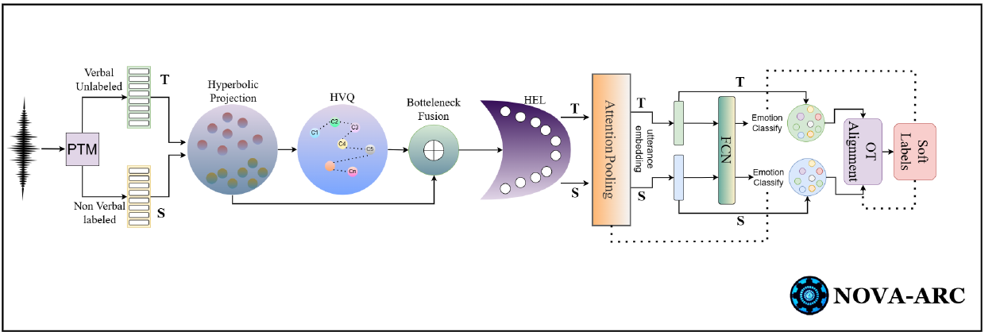

# Prosody as Supervision: Bridging the Non-Verbal–Verbal for Multilingual Speech Emotion Recognition

**Girish\*, Mohd Mujtaba Akhtar\*, Muskaan Singh**
*ACL 2026 (Main, Long Paper)*
\* Equal contribution

[](https://aclanthology.org/2026.acl-long.1940/)
[](https://arxiv.org/abs/2604.17647)


## Overview

Labelled emotional speech is scarce outside a few languages, and emotion labels on verbal speech are tangled up with words and language-specific conventions. **NOVA-ARC** (**NO**n-verbal to **V**erbal **A**daptation via hyperbolic Alignment, **R**adial calibration and **C**odebook tokens) instead learns emotion from **labelled non-verbal vocalisations** (laughs, sighs, cries) and adapts to **unlabelled verbal speech** in other languages, without any target emotion labels.

<p align="center"></p>

A shared network processes both the non-verbal source and the verbal target:

1. **Hyperbolic projection:** encoder frames are mapped into the Poincaré ball.
2. **Hyperbolic VQ (prosody tokens):** each frame is assigned to its nearest codeword under the Poincaré distance.
3. **Bottleneck fusion:** continuous frames and discrete tokens are combined by Möbius addition, then compressed.
4. **Hyperbolic Emotion Lens (HEL):** a learnable radial power-law warp (`r → r^α`) that calibrates emotion intensity between the two domains.
5. **Attention pooling** in the tangent space, then a linear emotion classifier.

For adaptation, class prototypes are the **Fréchet means** of source embeddings, refreshed each epoch. An **entropic optimal-transport** plan between prototypes and each target batch gives soft pseudo-labels:

```
L = L_S (source CE) + λ_OPT ⟨Π, M⟩ + λ_OT L_OT-CE (soft target CE) + λ_VQ L_VQ
```

## Quick start

From the repository root:

```bash
pip install -r requirements.txt

# NOVA-ARC on generated source/target data with a domain shift (~30 s on CPU)
python -m papers.nova_arc.train --synthetic

# the same without adaptation (source-only), for comparison
python -m papers.nova_arc.train --synthetic --set model.adaptation=none
```

On the synthetic data, adaptation should clearly beat source-only training (about 99% vs 79% target accuracy in our runs). That only shows the adaptation machinery works; it says nothing about real data.

## Running on the paper's datasets

**Datasets.** ASVP-ESD is the labelled source: its non-verbal split is the main setting, and its verbal split is the complementary one. MESD, AESDD, RAVDESS, Emo-DB and CREMA-D are the unlabelled verbal targets. All are mapped to a shared five-class space: **0 happy, 1 anger, 2 disgust, 3 sadness, 4 fear**.

**1. Extract frame-level features** with any supported encoder (the paper's best is voc2vec):

```bash
python -m common.features.speech --model voc2vec --inputs asvp_nv.txt --out-dir data/asvp_nv
python -m common.features.speech --model voc2vec --inputs ravdess.txt --out-dir data/ravdess
```

Supported: `voc2vec`, `wavlm`, `wav2vec2`, `mms`.

**2. Write one manifest per domain** with `subject_id,features,label` (paths relative to the manifest). Target labels are only used for the final score.

**3. Train and evaluate.** Set `features.dim` in [`configs/nova_arc.yaml`](configs/nova_arc.yaml) (768 for voc2vec/WavLM/wav2vec 2.0, 1024 for MMS-1B), then:

```bash
python -m papers.nova_arc.train --source data/asvp_nv/manifest.csv --target data/ravdess/manifest.csv
```

**Ablations (Tables 3–4)** are config switches, e.g. `--set model.geometry=euclidean`, `model.use_hel=false`, `model.tokens=continuous` (no VQ), `model.tokens=discrete` (tokens only), `model.fusion=concat` (no Möbius), `model.ot_geometry=euclidean`.

## Published results

Results as reported in the paper (accuracy / macro-F1, %). Numbers from a rerun can vary slightly with feature extraction, data splits and random seeds. The encoder is voc2vec and the source is ASVP-ESD non-verbal; each target is unlabelled verbal speech.

**Main result (Tables 2–3):**

| Target | Zero-shot (no adaptation) | NOVA-ARC, Euclidean | **NOVA-ARC, hyperbolic** |
|---|---|---|---|
| ASVP-ESD (verbal) | 62.23 / 60.87 | 87.31 / 85.06 | **92.40 / 89.79** |
| MESD | 54.71 / 51.90 | 84.58 / 81.92 | **90.67 / 89.05** |
| AESDD | 56.86 / 55.12 | 79.63 / 78.21 | **84.39 / 82.92** |
| RAVDESS | 60.01 / 58.42 | 87.04 / 85.53 | **93.79 / 90.61** |
| Emo-DB | 57.93 / 55.16 | 86.71 / 83.69 | **92.46 / 90.68** |
| CREMA-D | 61.27 / 59.46 | 85.26 / 84.03 | **91.32 / 89.87** |

**Ablations (Table 4, ASVP-ESD non-verbal → verbal):**

| Variant | Acc | F1 |
|---|---|---|
| **NOVA-ARC (full)** | **92.40** | **89.79** |
| Euclidean space | 87.31 | 85.06 |
| Euclidean OT | 80.24 | 75.64 |
| Tokens only (discrete) | 76.90 | 73.18 |
| No VQ (continuous only) | 74.22 | 70.43 |
| No HEL | 72.75 | 51.44 |
| Euclidean w/o EEL | 70.01 | 46.61 |
| Concat/MLP (no Möbius) | 65.36 | 62.24 |
| Adversarial DA | 53.49 | 43.76 |
| OT-UDA baseline | 50.78 | 41.33 |

Under 10 dB SNR noise on the target, the hyperbolic variant reaches 79.44 / 78.09, against 67.01 / 62.35 for the Euclidean one.

## Implementation notes

| Component | Setting |
|---|---|
| Encoder | Frozen, with a trainable projection `W_p` on pre-extracted frame features |
| Codebook | Codewords parameterised in the tangent space and mapped into the ball |
| VQ losses | Codebook + commitment (β = 0.25) on tangent-space vectors |
| HEL | `v → (‖v‖ + ε)^α · v / (‖v‖ + ε)` in the tangent space, with α learned (initialised at 1.0) |
| Attention pooling | `softmax(w · Log₀ b̃_t)` with one shared vector `w` |
| Fréchet mean | Karcher iterations on the Poincaré ball |
| OT cost | Squared Poincaré distance, rescaled by its maximum inside Sinkhorn so that ε_OT = 0.05 is scale-free |
| Tangent clipping | Norms clipped to 1 before every exponential map, keeping points away from the ball boundary |
| Batches | Equal-size source and target batches; the shorter loader cycles |

## Files

| File | Contents |
|---|---|
| [`model.py`](model.py) | NOVA-ARC model, prototype refresh and loss |
| [`train.py`](train.py) | Adaptation training loop and target evaluation |
| [`configs/nova_arc.yaml`](configs/nova_arc.yaml) | Hyperparameters, with paper values marked |

## Citation

```bibtex
@inproceedings{girish-etal-2026-prosody,
  title     = {Prosody as Supervision: Bridging the Non-Verbal--Verbal for Multilingual Speech Emotion Recognition},
  author    = {Girish and Akhtar, Mohd Mujtaba and Singh, Muskaan},
  booktitle = {Proceedings of the 64th Annual Meeting of the Association for Computational Linguistics (Volume 1: Long Papers)},
  year      = {2026},
  publisher = {Association for Computational Linguistics},
  url       = {https://aclanthology.org/2026.acl-long.1940/}
}
```
