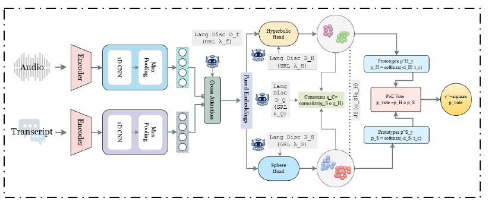

# ORBIT: Synergizing Zero-Shot Cross-Lingual Alzheimer Detection with Language-Invariant Multimodal Bi-Geometric Adversarial Learning

**Girish\*, Mohd Mujtaba Akhtar\*, Farhan Sheth\*, Muskaan Singh, Juliana Gerard, Paula McClean, KongFatt Wong-Lin**
*INTERSPEECH 2026 · Oral*
\* Equal contribution

[](https://arxiv.org/abs/2606.17254)


> **About this code.** This is a PyTorch re-implementation written from the paper's method section. It is **not** the original experimental code, so it will not reproduce the published numbers exactly. Every detail the paper leaves open is marked `# [impl]` in [`model.py`](model.py) and listed [below](#implementation-choices).

## Overview

Speech-based Alzheimer's disease detection models usually work well only in the language they were trained on. **ORBIT** (**O**ptimized **R**epresentation learning via **BI**-geometric and adversarial **T**raining) detects AD in languages it has **never seen**. It fuses multilingual speech and text encoders, and uses adversaries to stop the fused representation from encoding which language is being spoken.

<p align="center"></p>

1. **Encoders and pooling:** audio frames (e.g. mHuBERT-147) and transcript tokens (e.g. Qwen3-Embeddings) pass through light 1-D convs and attention pooling.
2. **Bidirectional cross-attention:** each modality is conditioned on the other, then fused by an MLP into `f`.
3. **Bi-geometric heads:** `f` is projected onto a **hypersphere** (angular structure) and a **Poincaré ball** (hierarchical structure).
4. **Cluster consensus:** K cluster centres per manifold give soft assignments that are combined by a product of experts, with DEC-style sharpening, a Jensen–Shannon agreement term and a prototype margin.
5. **Prototype classification:** class prototypes on each manifold, combined by a **product-of-experts vote**.
6. **Multi-tap language adversaries:** gradient-reversal discriminators on `f`, on both geometric embeddings and on the cluster assignments, so language cues are removed wherever they reappear.

```
L = L_cls + λ_BGCC (L_dec + L_js + L_margin) + Σ_Z λ_Z CE(D_Z(GRL(Z)), language)
```

## Quick start

From the repository root:

```bash
pip install -r requirements.txt

# leave-one-language-out on generated four-language data (~30 s on CPU)
python -m papers.orbit.train --synthetic

# leave-two-languages-out: train on English + Chinese, test on Spanish + Greek
python -m papers.orbit.train --synthetic --protocol ltlo --train-languages english,chinese
```

## Running on the paper's datasets

**Corpus.** Four languages; the task is binary AD vs healthy control.

| Language | Dataset | HC | AD |
|---|---|---|---|
| English | Pitt (DementiaBank, Cookie Theft) | 243 | 309 |
| Spanish | Ivanova (reading) | 196 | 74 |
| Chinese | NCMMSC | 108 | 79 |
| Greek | Dem@Care (DS3, DS5, DS7; transcripts from Whisper-large-v3) | 58 | 115 |

All four come from their original custodians under their own access terms.

**1. Extract features**, audio frames and transcript tokens:

```bash
python -m common.features.speech --model mhubert --inputs audio.txt --out-dir data/sadd/audio
python -m common.features.text   --model qwen3   --inputs transcripts.tsv --out-dir data/sadd/text
```

Speech: `mhubert`, `whisper`, `wav2vec2`, `mms`, `xlsr`. Text: `mbert`, `xlmr`, `e5`, `qwen3`.

**2. Write a manifest** with `subject_id,audio,text,label,language` (label 1 = AD).

**3. Train and evaluate.** Set `features` in [`configs/orbit.yaml`](configs/orbit.yaml) to your encoders' sizes (768 for mHuBERT, 1024 for Qwen3), then:

```bash
python -m papers.orbit.train --manifest data/sadd/manifest.csv --protocol lolo
python -m papers.orbit.train --manifest data/sadd/manifest.csv --protocol ltlo --train-languages english,chinese
```

**Ablations (Table 3)** and the **cross-attention comparison (Table 2)** are config switches:

```bash
--set model.use_grl=false
--set model.cross_attention=false
--set "model.geometries=[hyperbolic]"            # or [sphere], [hyperbolic, euclidean], [sphere, euclidean]
--model concat_cnn                               # plain concatenation baseline
```

## Published results

Results reported in the paper, from the authors' original experiments (accuracy / macro-F1, %). **LTLO** trains on two languages and tests on the other two; **LOLO** trains on three and tests on the fourth.

**Best configurations (Table 2):**

| Setting | Pair | LTLO | LOLO |
|---|---|---|---|
| Audio only: baseline → ORBIT | Whisper | 62.55 / 61.05 → 75.15 / 72.01 | 65.33 / 63.18 → 80.15 / 77.34 |
| Text only: baseline → ORBIT | Qwen3-Emb. | 70.97 / 62.06 → 79.23 / 76.79 | 72.43 / 69.14 → 84.06 / 81.48 |
| **ORBIT, audio + text (with cross-attention)** | mHuBERT + Qwen3 | 83.91 / 81.70 | **86.98 / 85.29** |
| ORBIT, audio + text (with cross-attention) | mHuBERT + E5 | **85.49** / 82.13 | 84.56 / 83.67 |

**Ablations (Table 3, mHuBERT + Qwen3 with cross-attention):**

| Variant | LTLO | LOLO |
|---|---|---|
| **ORBIT (full)** | **83.91 / 81.70** | **86.98 / 85.29** |
| Hyperbolic + Euclidean | 81.36 / 80.00 | 83.78 / 81.69 |
| Only hyperbolic | 79.83 / 76.59 | 82.65 / 80.18 |
| Sphere + Euclidean | 79.28 / 77.60 | 81.31 / 79.78 |
| Only sphere | 76.72 / 74.34 | 77.81 / 76.97 |
| w/o gradient reversal | 70.99 / 68.48 | 74.53 / 71.41 |

## Implementation choices

| Detail | Choice here | Why |
|---|---|---|
| Encoders | Frozen; features pre-extracted | The paper unfreezes the top layers after 2–3 epochs |
| Cross-attention | The pooled vector of each modality queries the other modality's sequence | "One embedding as the query and the other as context"; pooled-to-pooled attention would be trivial |
| `L_margin` | Hinge: the true-class prototype must be closer than the other by margin 0.5, in each geometry | Named in the paper but not defined |
| `L_cls` | NLL of the product-of-experts vote `p_vote` | The prediction is `argmax p_vote` |
| `K`, τ, τ_c, r, c | 4, 0.1, 0.1, 1, 1 | Not reported (the paper says K > 2) |
| λ_BGCC, λ_Z, GRL coefficient | 0.1, 0.1 (every tap), 1.0 | Not reported |
| Validation | 10% of training-language speakers held out for early stopping | The paper uses early stopping but gives no split |
| LTLO scoring | Averaged over the two held-out languages | As in the paper |

## Files

| File | Contents |
|---|---|
| [`model.py`](model.py) | ORBIT model and loss |
| [`train.py`](train.py) | LOLO / LTLO protocols, training and evaluation |
| [`configs/orbit.yaml`](configs/orbit.yaml) | Hyperparameters, with paper values marked |

## Citation

```bibtex
@inproceedings{girish2026orbit,
  title     = {Synergizing Zero-Shot Cross-Lingual Alzheimer Detection with Language-Invariant Multimodal Bi-Geometric Adversarial Learning},
  author    = {Girish and Akhtar, Mohd Mujtaba and Sheth, Farhan and Singh, Muskaan and Gerard, Juliana and McClean, Paula and Wong-Lin, KongFatt},
  booktitle = {Proc. Interspeech 2026},
  year      = {2026},
  eprint    = {2606.17254},
  archivePrefix = {arXiv}
}
```

## Ethics

The clinical corpora are used under their original licences and access agreements. ORBIT is a research prototype for screening research. It is not a diagnostic tool.
