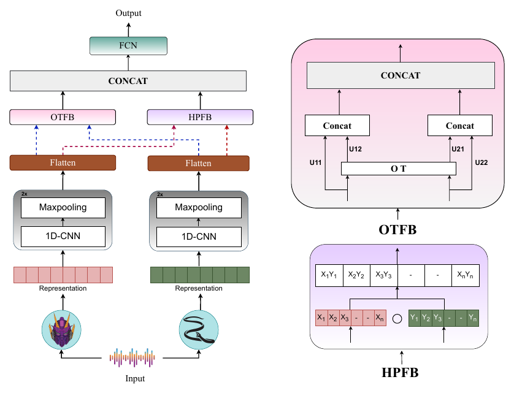

# PARROT: Synergizing Mamba and Attention-based SSL Pre-Trained Models via Parallel Branch Hadamard Optimal Transport for Speech Emotion Recognition

**Orchid Chetia Phukan\*, Mohd Mujtaba Akhtar\*, Girish\*, Swarup Ranjan Behera, Jaya Sai Kiran Patibandla, Arun Balaji Buduru, Rajesh Sharma**
*INTERSPEECH 2025*
\* Equal contribution

[](https://arxiv.org/abs/2506.01138)
[](https://doi.org/10.21437/Interspeech.2025-2233)


## Overview

Mamba-based (state-space) audio models and attention-based self-supervised models capture speech differently: the former excel at efficient long-range processing, the latter at complex global dependencies. The paper compares both families for speech emotion recognition (SER) and shows that **fusing a Mamba model with an attention model** brings out their complementary strengths.

**PARROT** (**PAR**allel B**R**anch Hadamard **O**ptimal **T**ransport) fuses the two with two parallel branches:

<p align="center"></p>

1. Each embedding passes through two conv blocks (Conv1d with 64 and 128 filters, kernel 3, ReLU, max-pool), is flattened and projected to 120 dimensions (`R_p`, `R_q`).
2. **Hadamard Product Fusion Block (HPFB):** `HP = R_p ⊙ R_q` captures local, element-wise interactions.
3. **Optimal Transport Fusion Block (OTFB):** a normalised Euclidean cost `C = ‖R_p − R_q‖₂ / max`, a Sinkhorn plan `Γ`, and transported features `R_p→R_q = Γ·R_p`, `R_q→R_p = Γᵀ·R_q`, giving `F_q = [R_p→R_q, R_q]` and `F_p = [R_q→R_p, R_p]`. This aligns the two feature distributions globally.
4. Both branches are concatenated and passed to a dense layer of 128 units and a softmax over emotions.

## Quick start

From the repository root:

```bash
pip install -r requirements.txt

python -m papers.parrot.train --synthetic                        # PARROT on generated data
python -m papers.parrot.train --synthetic --model concat         # concatenation fusion
python -m papers.parrot.train --synthetic --model hadamard       # HPFB branch only
python -m papers.parrot.train --synthetic --model ot             # OTFB branch only
python -m papers.parrot.train --synthetic --model cnn --stream fm1   # one model, CNN head
```

## Running on the paper's datasets

**Datasets.** **CREMA-D** (English, 6 emotions), **Emo-DB** (German, 7 emotions) and **MESD** (Mexican Spanish, 6 emotions), each with 5-fold cross-validation (four folds train, one tests).

**1. Extract utterance-level embeddings** (average-pooled last hidden layer):

```bash
python -m common.features.speech --model hubert --pool --inputs cremad.txt --out-dir data/cremad/hubert
python -m common.features.speech --model mms    --pool --inputs cremad.txt --out-dir data/cremad/mms
```

Also supported: `wavlm`, `wav2vec2`, `unispeech_sat`. **Audio-Mamba** (tiny 960-d, small 1920-d, base 3840-d) comes from the official Audio-Mamba release; save its pooled embeddings as `.npy` vectors.

**2. Write a manifest** with `subject_id,fm1,fm2,label`. Folds are split by `subject_id`; use the speaker ID for speaker-independent folds.

**3. Train and evaluate.** Set `features` and `num_classes` in [`configs/parrot.yaml`](configs/parrot.yaml), then:

```bash
python -m papers.parrot.train --manifest data/cremad/manifest.csv
```

## Published results

Results as reported in the paper (accuracy / macro-F1, %, average of five folds). Numbers from a rerun can vary slightly with feature extraction, data splits and random seeds. A(B) = Audio-Mamba base, H = HuBERT, M = MMS, W2 = wav2vec 2.0.

**Fusion (Table 2), selected pairs:**

| Pair | CREMA-D: Concat → **PARROT** | Emo-DB: Concat → **PARROT** | MESD: Concat → **PARROT** |
|---|---|---|---|
| **A(B) + H** | 70.63 / 69.79 → **73.68 / 72.90** | 89.92 / 88.24 → **92.24 / 91.53** | 58.31 / 56.08 → 59.54 / 58.94 |
| A(B) + M | 61.25 / 60.97 → 63.26 / 63.24 | 65.96 / 64.05 → 66.36 / 57.29 | 66.37 / 65.28 → 69.05 / 68.72 |
| W2 + M | 64.19 / 63.61 → 65.21 / 65.01 | 80.91 / 79.31 → 81.52 / 80.96 | 72.14 / 71.39 → 71.10 / 70.96 |

**Single models, CNN head (Table 1):** Audio-Mamba base 69.91 / 69.90 (CREMA-D), 84.11 / 82.90 (Emo-DB), 78.03 / 77.96 (MESD); HuBERT 69.95 / 68.23, 88.26 / 87.11, 62.43 / 62.43.

## Implementation notes

| Component | Setting |
|---|---|
| Inputs | Utterance-level embeddings, read as a one-channel sequence by the 1-D convolutions |
| Optimal transport | Computed across the rows of each mini-batch with uniform marginals; Sinkhorn with ε = 0.05 on the max-normalised cost, 50 iterations |
| Transported features | Barycentric maps (the plan is rescaled by the batch size), so each transported row lines up with the row it is concatenated with |
| Concatenation baseline | Same network with both fusion branches removed |
| Training | Adam, lr 1e-3, batch 32, 50 epochs, dropout, early stopping (10% of training speakers held out) |

Because the transport plan is computed within a batch, evaluation also runs in batches of 32.

## Files

| File | Contents |
|---|---|
| [`model.py`](model.py) | PARROT model with HPFB and OTFB branches |
| [`train.py`](train.py) | 5-fold CV for PARROT and the baselines |
| [`configs/parrot.yaml`](configs/parrot.yaml) | Hyperparameters, with paper values marked |
| [`../../common/ot.py`](../../common/ot.py) | Sinkhorn solver and batch feature transport |

## Citation

```bibtex
@inproceedings{phukan2025parrot,
  title     = {{PARROT}: Synergizing Mamba and Attention-based {SSL} Pre-Trained Models via Parallel Branch Hadamard Optimal Transport for Speech Emotion Recognition},
  author    = {Phukan, Orchid Chetia and Akhtar, Mohd Mujtaba and Girish and Behera, Swarup Ranjan and Patibandla, Jaya Sai Kiran and Buduru, Arun Balaji and Sharma, Rajesh},
  booktitle = {Proc. Interspeech 2025},
  year      = {2025},
  pages     = {4468--4472},
  doi       = {10.21437/Interspeech.2025-2233}
}
```
