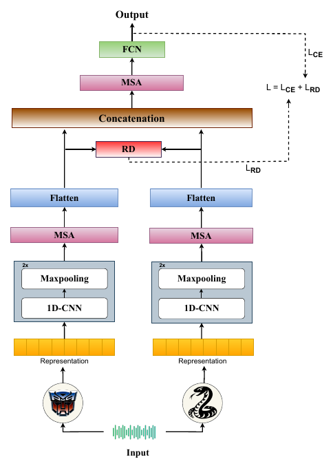

# Are Mamba-Based Audio Foundation Models the Best Fit for Non-Verbal Emotion Recognition?

**Mohd Mujtaba Akhtar\*, Orchid Chetia Phukan\*, Girish\*, Swarup Ranjan Behera, Ananda Chandra Nayak, Sanjib Kumar Nayak, Arun Balaji Buduru, Rajesh Sharma**
*EUSIPCO 2025*
\* Equal contribution

[](https://arxiv.org/abs/2506.02258)


## Overview

The paper is the first to study **Mamba-based audio foundation models** (MAFMs, built on state-space models) for non-verbal emotion recognition (NVER). The hypothesis is that state-space modelling extracts more stable, context-aware representations of subtle non-verbal cues than attention-based audio foundation models (AAFMs), which can amplify irrelevant patterns. Experiments on three NVER datasets support it: Audio-Mamba base is the strongest single representation.

**RENO** (**REN**yi Attenti**O**n Network) fuses a Mamba model with an attention model:

<p align="center"></p>

1. Each embedding passes through two conv blocks (Conv1d with 32 and 64 filters, kernel 3, max-pool).
2. **Multi-head self-attention** (2 heads) models interactions within each representation; the result is flattened.
3. The **Rényi divergence** between the two feature distributions aligns the representation spaces.
4. The aligned features are concatenated, refined by another self-attention block (2 heads) and classified by dense layers of 512 and 128 units.

```
L = λ · L_CE + (1 − λ) · L_RD,      L_RD = 1/(β−1) · log Σ_j (z_x,j + δ)^β (z_y,j + δ)^(1−β)
β = 2, δ = 0.2, λ = 0.4
```

## Quick start

From the repository root:

```bash
pip install -r requirements.txt

python -m papers.reno.train --synthetic                          # RENO on generated data (~20 s on CPU)
python -m papers.reno.train --synthetic --model concat           # concatenation fusion
python -m papers.reno.train --synthetic --model cnn --stream fm1     # one foundation model, CNN head
```

## Running on the paper's datasets

**Datasets.** **ASVP-ESD** (non-speech part), **JNV** and **VIVAE**, each with 5-fold cross-validation (four folds train, one tests).

**1. Extract utterance-level embeddings** (average-pooled last hidden layer):

```bash
python -m common.features.speech --model unispeech_sat --pool --inputs vivae.txt --out-dir data/vivae/unispeech_sat
python -m common.features.speech --model hubert        --pool --inputs vivae.txt --out-dir data/vivae/hubert
```

Also supported: `wavlm`, `wav2vec2`. **Audio-Mamba** (tiny 960-d, small 1920-d, base 3840-d) comes from the official Audio-Mamba release; save its pooled embeddings as `.npy` vectors.

**2. Write a manifest** with `subject_id,fm1,fm2,label`.

**3. Train and evaluate.** Set `features` and `num_classes` in [`configs/reno.yaml`](configs/reno.yaml), then:

```bash
python -m papers.reno.train --manifest data/vivae/manifest.csv
```

## Published results

Results as reported in the paper (accuracy / macro-F1, %, average of five folds). Numbers from a rerun can vary slightly with feature extraction, data splits and random seeds. A(T/S/B) = Audio-Mamba tiny / small / base, U = UniSpeech-SAT, H = HuBERT, W = WavLM.

**Best single representation, Audio-Mamba base with a CNN head (Table I):** 73.96 / 71.98 (ASVP-ESD), 64.29 / 63.81 (JNV), 62.42 / 61.29 (VIVAE).

**Fusion (Table II), selected Mamba + attention pairs:**

| Pair | ASVP-ESD: Concat → **RENO** | JNV: Concat → **RENO** | VIVAE: Concat → **RENO** |
|---|---|---|---|
| A(B) + U | 75.67 / 74.84 → **83.56 / 82.51** | 66.72 / 65.87 → 69.70 / 69.04 | 61.94 / 60.13 → 68.53 / 67.08 |
| A(B) + W | 75.21 / 74.47 → **83.56 / 82.54** | 66.74 / 65.27 → 72.56 / 71.09 | 63.70 / 62.65 → 72.76 / 71.65 |
| A(T) + H | 74.41 / 73.71 → 78.71 / 77.89 | 76.56 / 75.43 → **79.09 / 78.41** | 56.53 / 55.72 → 61.45 / 61.03 |
| A(B) + H | 75.09 / 74.21 → 77.98 / 76.48 | 67.88 / 66.60 → 71.90 / 71.62 | 67.69 / 66.51 → 72.51 / 71.82 |
| A(S) + W | 75.08 / 74.78 → 81.65 / 80.23 | 66.31 / 65.79 → 71.67 / 70.23 | 64.43 / 62.99 → **73.65 / 72.49** |


## Implementation notes

| Component | Setting |
|---|---|
| Inputs | Utterance-level embeddings, read as a one-channel sequence by the 1-D convolutions |
| Intra-representation attention | Over the conv feature-map positions (64-d tokens), 2 heads, residual connection and layer norm |
| Rényi divergence | On softmax distributions after a linear projection of each branch to a common width of 256 (the flattened sizes differ between encoders) |
| Inter-representation attention | The two aligned vectors are the tokens of a 2-head attention layer |
| Concatenation baseline | Same network without the Rényi loss and both attention blocks |
| Training | Adam, lr 1e-3, batch 32, 20 epochs, dropout, early stopping (10% of training speakers held out) |

## Files

| File | Contents |
|---|---|
| [`model.py`](model.py) | RENO model and loss |
| [`train.py`](train.py) | 5-fold CV for RENO and the baselines |
| [`configs/reno.yaml`](configs/reno.yaml) | Hyperparameters, with paper values marked |
| [`../../common/divergences.py`](../../common/divergences.py) | Rényi divergence |

## Citation

```bibtex
@inproceedings{akhtar2025mamba,
  title     = {Are Mamba-Based Audio Foundation Models the Best Fit for Non-Verbal Emotion Recognition?},
  author    = {Akhtar, Mohd Mujtaba and Phukan, Orchid Chetia and Girish and Behera, Swarup Ranjan and Nayak, Ananda Chandra and Nayak, Sanjib Kumar and Buduru, Arun Balaji and Sharma, Rajesh},
  booktitle = {33rd European Signal Processing Conference (EUSIPCO)},
  year      = {2025},
  pages     = {501--505},
  eprint    = {2506.02258},
  archivePrefix = {arXiv}
}
```
