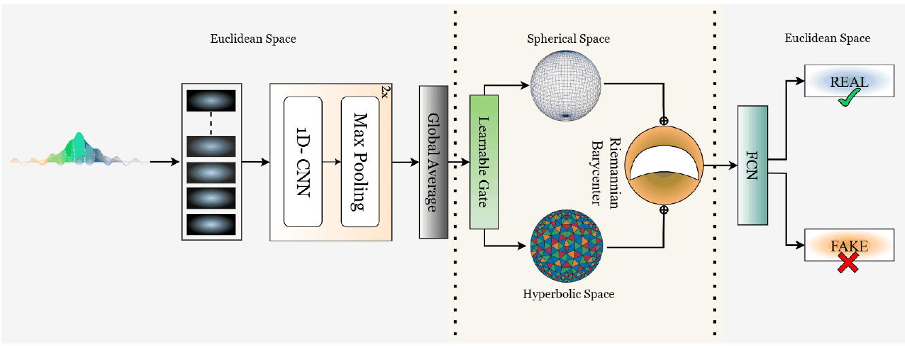

# Curved Worlds, Clear Boundaries: Generalizing Speech Deepfake Detection using Hyperbolic and Spherical Geometry Spaces

**Farhan Sheth\*, Girish\*, Mohd Mujtaba Akhtar\*, Muskaan Singh**
*IJCNLP-AACL 2025 (Main, Long Paper)*
\* Equal contribution

[](https://aclanthology.org/2025.ijcnlp-long.104/)


## Overview

Deepfake detectors trained on one generation paradigm (conventional TTS and voice conversion) generalise poorly to another (diffusion and flow-matching TTS), and vice versa. **RHYME** makes one speech representation more generalisable by viewing it in two curved geometries at once and fusing them on a Riemannian manifold:

<p align="center"></p>

1. Frame-level embeddings from a frozen speech foundation model pass through a **1-D conv encoder** `Φ_1D` and global average pooling, giving `u`.
2. A learned **gate** `α = σ(w_gᵀu + b_g)` splits `u` into `u_h = α·u` and `u_s = (1 − α)·u`.
3. **Hyperbolic branch:** `x_h = exp_0^c(u_h)` on the Poincaré ball (hierarchical generator structure).
4. **Spherical branch:** `x_s = u_s / ‖u_s‖` on the sphere, mapped into the same ball by stereographic projection, `y_s = x_s / (1 + √(1 − ‖x_s‖²))` (periodic, energy-invariant artefacts).
5. **Riemannian barycentre:** `z* = exp_0^c(α·log_0^c(x_h) + (1 − α)·log_0^c(y_s))`.
6. `r = log_0^c(z*)` goes to a light classifier (real / fake). Everything, including the curvature `c`, is trained end to end with cross-entropy.

## Quick start

From the repository root:

```bash
pip install -r requirements.txt

python -m papers.rhyme.train --synthetic                                 # TR-A -> TE-D and TR-D -> TE-A
python -m papers.rhyme.train --synthetic --set model.gating=fixed        # no gating (alpha = 0.5)
python -m papers.rhyme.train --synthetic --set model.branches=hyperbolic # no spherical branch
python -m papers.rhyme.train --synthetic --set model.branches=spherical  # no hyperbolic branch
python -m papers.rhyme.train --synthetic --set model.fusion=euclidean    # Euclidean fusion
```

The synthetic data has two domains whose fakes share some artefacts and differ in others, so the cross-domain EER is not trivial. EER is the headline metric; accuracy at the default 0.5 threshold is sensitive to the domain shift.

## Running on the paper's datasets

**Datasets.** **ASVspoof 2019 LA** (conventional TTS and VC) and **DFADD** (diffusion and flow-matching TTS). The main protocol is cross-dataset: train on ASVspoof 2019 and test on DFADD (TR-A → TE-D), and the reverse (TR-D → TE-A), with no target data in training.

**1. Extract frame-level features** (no pooling):

```bash
python -m common.features.speech --model wavlm --inputs asv_dfadd.txt --out-dir data/asv_dfadd/wavlm
```

Also supported: `wav2vec2`, `hubert`, `whisper`, `xvector`, `passt`. **USAD**, the paper's best encoder, comes from its own release; save its frame features as `(frames, 768)` `.npy` arrays.

**2. Write a manifest** with `subject_id,features,label,domain` (label 1 = spoof, `domain` = `asv` or `dfadd`) and optionally `system` (the spoofing system, `bonafide` for real speech) to also get per-system EERs.

**3. Train and evaluate.** Set `features` in [`configs/rhyme.yaml`](configs/rhyme.yaml), then:

```bash
python -m papers.rhyme.train --manifest data/asv_dfadd/manifest.csv --train-domain asv --test-domain dfadd
python -m papers.rhyme.train --manifest data/asv_dfadd/manifest.csv --train-domain dfadd --test-domain asv
python -m papers.rhyme.train --manifest data/asv_dfadd/manifest.csv --within asv     # 5-fold CV in one dataset
```

## Published results

Results as reported in the paper (EER, %, lower is better). Numbers from a rerun can vary slightly with feature extraction, data splits and random seeds.

**Cross-dataset generalisation (Table 1):**

| Encoder | Baseline: TR-A → TE-D | Baseline: TR-D → TE-A | **RHYME: TR-A → TE-D** | **RHYME: TR-D → TE-A** |
|---|---|---|---|---|
| x-vector | 33.27 | 22.71 | 28.09 | 16.96 |
| WavLM | 29.37 | 20.05 | 21.87 | 13.17 |
| HuBERT | 33.52 | 25.56 | 28.66 | 16.63 |
| Whisper | 30.36 | 24.38 | 27.54 | 17.45 |
| Wav2Vec 2.0 | 28.42 | 19.89 | 22.81 | 12.46 |
| PaSST | 27.24 | 17.23 | 20.38 | 11.59 |
| **USAD** | 20.51 | 15.19 | **14.12** | **10.26** |

For reference, the DFADD paper reports an average EER of 32.44% for the end-to-end AASIST-L model under TR-A → TE-D.

**Ablations with USAD (Table 3):**

| Configuration | TR-A → TE-D | TR-D → TE-A |
|---|---|---|
| **RHYME** | **14.12** | **10.26** |
| No gating (α = 0.5) | 19.94 | 14.78 |
| No spherical branch | 18.01 | 14.22 |
| No hyperbolic branch | 17.88 | 13.89 |
| Euclidean fusion (no geometry) | 19.33 | 15.12 |
| Baseline (USAD only) | 20.51 | 15.19 |

**Unseen synthesizers (Table 2)** evaluates RHYME with USAD on speech from eight further diffusion / flow-matching systems (VoiceBox, VoiceFlow, NaturalSpeech 3, Causal Multi-scale TTS, DiffProsody, DiffAR, DiTTo-TTS, ReFlow-TTS) across seven test domains; for example, on DFADD-domain audio the EER ranges from 0 (DiffAR, ReFlow-TTS, Causal Multi-scale TTS) to 10.38 (VoiceBox).

## Implementation notes

| Component | Setting |
|---|---|
| Φ_1D | Two Conv1d blocks (256 and 128 channels, kernel 3, batch norm, ReLU); d = 128 |
| Classifier | Dense layer of 128 units + ReLU + dropout, then the output layer |
| Curvature | Learned through a softplus parameterisation, initialised at c = 1 |
| Spherical branch | The unit-sphere point is scaled to radius 0.9/√c before the stereographic map, so it lies strictly inside the ball |
| Hyperbolic branch | Tangent vectors clipped to norm 1 before the exponential map, keeping points away from the boundary |
| "No spherical" / "No hyperbolic" | The whole of `u` goes through the remaining branch |
| Training | Adam, lr 1e-3, batch 32, 50 epochs, dropout, early stopping (10% of training speakers held out) |

## Files

| File | Contents |
|---|---|
| [`model.py`](model.py) | RHYME model with the ablation switches |
| [`train.py`](train.py) | Cross-dataset and within-dataset protocols, per-system EER |
| [`configs/rhyme.yaml`](configs/rhyme.yaml) | Hyperparameters, with paper values marked |
| [`../../common/geometry.py`](../../common/geometry.py) | Poincaré-ball maps and the stereographic projection |

## Citation

```bibtex
@inproceedings{sheth-etal-2025-curved,
  title     = {Curved Worlds, Clear Boundaries: Generalizing Speech Deepfake Detection using Hyperbolic and Spherical Geometry Spaces},
  author    = {Sheth, Farhan and Girish and Akhtar, Mohd Mujtaba and Singh, Muskaan},
  booktitle = {Proceedings of the 14th International Joint Conference on Natural Language Processing and the 4th Conference of the Asia-Pacific Chapter of the Association for Computational Linguistics},
  year      = {2025},
  publisher = {Association for Computational Linguistics},
  url       = {https://aclanthology.org/2025.ijcnlp-long.104/}
}
```

## Ethics

RHYME is intended for defensive research on synthetic-speech detection. A detector's score is not proof that a recording is genuine or fake.
