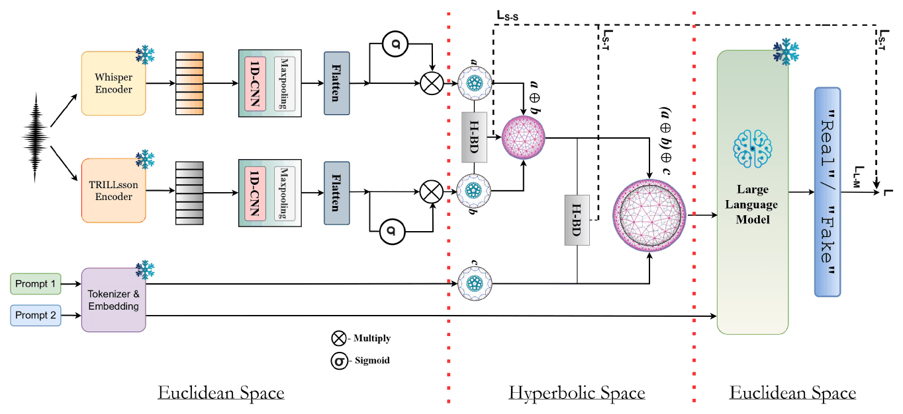

# Indic-CodecFake meets SATYAM: Towards Detecting Neural Audio Codec Synthesized Speech Deepfakes in Indic Languages

**Girish\*, Mohd Mujtaba Akhtar\*, Orchid Chetia Phukan\*, Arun Balaji Buduru**
*Findings of ACL 2026*
\* Equal contribution

[](https://aclanthology.org/2026.findings-acl.2159/)
[](https://arxiv.org/abs/2604.19949)
[](https://helixometry.github.io/IndicFake/)


## Overview

Neural audio codecs (NACs), the tokenizers behind today's audio language models, can resynthesise speech that is very hard to tell from the original. Codec-fake (CF) detection has so far been studied for English and Chinese. The paper contributes:

1. **Indic-CodecFake (ICF)**, the first large-scale CF benchmark for Indic languages: bona fide speech from IndicSUPERB (12 languages) resynthesised through eight codec families (DAC, EnCodec, SoundStream, SpeechTokenizer, SNAC for the *seen* setting; FunCodec, AudioDec, Mimi held out for the *unseen* setting), keeping IndicSUPERB's original splits.
2. **SATYAM**, a hyperbolic audio-language model (ALM) for CF detection.

<p align="center"></p>

1. **Two speech views:** semantic (Whisper encoder, `e_w`) and paralinguistic (TRILLsson, `e_t`). Each passes a lightweight CNN block (Conv1d, kernel 3, max-pool), a projection into a shared d-dimensional space and a sigmoid gate.
2. **Hyperbolic mapping:** `h_w = exp_0^c(ẽ_w)`, `h_t = exp_0^c(ẽ_t)` on the Poincaré ball.
3. **Speech–speech alignment and fusion:** Bhattacharyya distance `L_S-S = D_B(h_w, h_t)`; Möbius addition `h_f = h_w ⊕_c h_t`.
4. **Prompt conditioning:** the prompt *"Analyze the speech for unnatural artifacts"* is encoded by Qwen2 (intermediate-layer hidden states, mean-pooled), projected and mapped to the ball (`h_A`). `L_S-T = D_B(h_f, h_A)`; `h_final = h_f ⊕_c h_A`.
5. **Decoding:** `g = W_g · log_0^c(h_final)` is injected as prefix tokens into a **frozen Qwen2-7B** decoder, followed by the decision prompt *"Determine whether the speech is real or fake. Answer only in one word: "Real" or "Fake""*. The output is constrained to *Real* or *Fake*.

```
L = λ1 · L_S-S + λ2 · L_S-T + λ3 · L_LM,      λ1, λ2, λ3 = 1, 0.5, 1
```

## Quick start

From the repository root:

```bash
pip install -r requirements.txt

python -m papers.satyam.train --synthetic                  # SATYAM with a tiny offline LM (~15 s on CPU)
python -m papers.satyam.train --synthetic --model concat   # (C)    Euclidean concatenation
python -m papers.satyam.train --synthetic --model ma       # (MA)   Möbius fusion without BD alignment
python -m papers.satyam.train --synthetic --model e_bd     # (E-BD) BD alignment in Euclidean space
python -m papers.satyam.train --synthetic --model h_bd_ss  # hyperbolic BD on the speech-speech stage only
python -m papers.satyam.train --synthetic --model h_bd_st  # hyperbolic BD on the speech-prompt stage only
```

`--synthetic` swaps Qwen2 for a tiny randomly initialised causal LM so the test runs offline. A random LM has no language knowledge to steer, so the smoke test also adds LoRA adapters to it; real runs keep Qwen2 frozen, as in the paper.

## Running on ICF

**1. Extract utterance-level embeddings:**

```bash
python -m common.features.speech --model whisper   --pool --inputs icf.txt --out-dir data/icf/whisper     # 512-d
python -m common.features.speech --model trillsson --pool --inputs icf.txt --out-dir data/icf/trillsson   # 1024-d
```

**2. Write a manifest** with `subject_id,whisper,trillsson,label,split` (label 1 = codec fake). Put the seen codecs (test-known) and the unseen codecs (test-unknown) in separate test manifests to report both.

**3. Train and evaluate** (needs a GPU and access to `Qwen/Qwen2-7B` on the Hugging Face Hub):

```bash
python -m papers.satyam.train --manifest data/icf/manifest.csv
python -m papers.satyam.train --manifest data/icf/manifest.csv --set lm.backbone=Qwen/Qwen-1_8B   # lighter decoder
```

Only the CNN, projection, gating, prompt projection and prefix modules train (AdamW, lr 1e-4, batch 32, 5 epochs). The detection score for EER is `log p("Fake") − log p("Real")`.

## Published results

Results as reported in the paper (accuracy / EER, %). Numbers from a rerun can vary slightly with feature extraction, data splits and random seeds. W = Whisper, T = TRILLsson.

**In-domain results on ICF and CodecFake (CF) (Table 2):**

| Model | ICF | CF |
|---|---|---|
| AASIST | 90.60 / 12.47 | 94.21 / 10.13 |
| MiO | 92.80 / 9.04 | 95.11 / 6.49 |
| Qwen2-Audio-Base (fine-tuned projection) | 93.19 / 8.34 | 95.55 / 5.60 |
| W + T + Qwen2-7B (C) | 93.28 / 7.94 | 95.75 / 4.39 |
| W + T + Qwen2-7B (MA) | 94.01 / 7.02 | 95.31 / 4.07 |
| W + T + Qwen2-7B (E-BD) | 94.93 / 5.39 | 96.47 / 3.68 |
| W + T + Qwen2-7B (H-BD-ST) | 95.78 / 5.14 | 97.22 / 2.69 |
| W + T + Qwen2-7B (H-BD-SS) | 96.11 / 5.02 | 97.34 / 2.42 |
| **SATYAM (Qwen2-7B)** | **98.32 / 3.27** | **99.11 / 1.94** |
| SATYAM with Qwen2-1.8B | 97.14 / 4.53 | 98.32 / 2.11 |

Zero-shot, the best off-the-shelf ALM (Qwen2-Audio-Base) reaches only 13.41 / 88.57 on ICF.

**Generalisation (EER):**

| Setting | SATYAM | AASIST |
|---|---|---|
| Train ICF → test CF | 3.79 | 29.81 |
| Train CF → test ICF | 7.43 | 40.32 |
| Random cross-lingual split (both directions) | 6.34 / 7.09 | 26.74 / 31.11 |
| Dravidian → Indo-European | 7.78 | 38.73 |
| Indo-European → Dravidian | 8.48 | 33.45 |

## Implementation notes

| Component | Setting |
|---|---|
| CNN block | One Conv1d (32 filters, kernel 3) + max-pool over the pooled embedding, flattened |
| Shared space and gate | d = 256; gate `σ(W e) ⊙ e` |
| Bhattacharyya distance | Computed after the log map back to Euclidean space, on softmax feature distributions |
| Prompt representation | Mean-pooled hidden states of the middle transformer layer, computed once and kept fixed; its projection is trained |
| Prefix | 4 prefix tokens of the LM's hidden size |
| Answer scoring | Log-likelihood of each answer given the prefix and decision prompt; `L_LM` is the token-level negative log-likelihood of the correct answer |
| Curvature | c = 1, with tangent vectors clipped to norm 1 before the exponential map |
| Ablations | C: Euclidean concatenation in both stages; MA: Möbius fusion without BD; E-BD: BD alignment in Euclidean space; H-BD-SS / H-BD-ST: hyperbolic BD on one stage only |

## Files

| File | Contents |
|---|---|
| [`model.py`](model.py) | SATYAM model and loss, with the ablation switches |
| [`train.py`](train.py) | Training and evaluation on the official splits |
| [`configs/satyam.yaml`](configs/satyam.yaml) | Hyperparameters, with paper values marked |
| [`../../common/alm.py`](../../common/alm.py) | Prefix-LM head (Hugging Face causal LMs or the offline toy LM), LoRA |

## Citation

```bibtex
@inproceedings{girish-etal-2026-indic,
  title     = {Indic-CodecFake meets {SATYAM}: Towards Detecting Neural Audio Codec Synthesized Speech Deepfakes in Indic Languages},
  author    = {Girish and Akhtar, Mohd Mujtaba and Phukan, Orchid Chetia and Buduru, Arun Balaji},
  booktitle = {Findings of the Association for Computational Linguistics: ACL 2026},
  year      = {2026},
  publisher = {Association for Computational Linguistics},
  url       = {https://aclanthology.org/2026.findings-acl.2159/}
}
```

## Ethics

ICF and SATYAM are built for defensive research against codec-based speech manipulation. The source speech keeps the IndicSUPERB licence and usage terms. A detector's output is not proof about a recording on its own.
