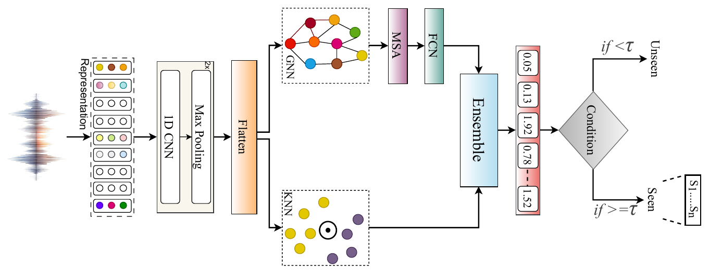

# SIGNAL: Bridging Attribution and Open-Set Detection using Graph-Augmented Instance Learning in Synthetic Speech

**Mohd Mujtaba Akhtar\*, Girish\*, Farhan Sheth\*, Muskaan Singh**
*EACL 2026 (Main, Long Paper)*
\* Equal contribution

[](https://aclanthology.org/2026.eacl-long.250/)


## Overview

A source-tracing system has two jobs: say **which known generator** produced a synthetic utterance, and notice when an utterance comes from a generator it has **never seen**. Closed-set classifiers do the first well but are overconfident on unseen generators. The paper benchmarks speech foundation models on this problem, finds that **Mamba-based** audio models capture generator traits best, and proposes a hybrid that handles both jobs.

**SIGNAL** combines graph reasoning over generator prototypes with instance-based reasoning over training examples:

<p align="center"></p>

1. **Encoder:** a frozen speech foundation model embedding `z0` is projected by a small CNN (two Conv1d layers with ReLU and max-pool, then a dense layer) to `z ∈ R^64`.
2. **GNN head:** one learnable prototype node `e_i` per seen generator. The query is projected, `s = W_s z`, and added to every node, `ẽ_i = e_i + s`. Multi-head self-attention passes messages between the nodes, each node gives a logit `ℓ_i = wᵀẽ'_i`, and `p_GNN = softmax(ℓ)`. The entropy of `p_GNN` is an uncertainty signal.
3. **KNN branch:** a distance-weighted k-nearest-neighbour vote over training embeddings, `w_k = 1 / (‖z − z_k‖² + ε)`.
4. **Ensemble and open-set routing:** `p_ens = α·p_GNN + (1 − α)·p_KNN`; a sample is labelled **unseen** when `max(p_ens) < τ`, with τ = 0.5.

Only the encoder and the GNN head are trained (cross-entropy over the seen generators); the KNN branch needs no training.

## Quick start

From the repository root:

```bash
pip install -r requirements.txt

python -m papers.signal.train --synthetic                        # SIGNAL (KNN + GNN), ~10 s on CPU
python -m papers.signal.train --synthetic --set model.alpha=1.0  # GNN only
python -m papers.signal.train --synthetic --set model.alpha=0.0  # KNN only
python -m papers.signal.train --synthetic --model cnn            # CNN baseline
python -m papers.signal.train --synthetic --set model.tau=0.3    # another open-set threshold
```

The synthetic data holds out two generators that appear only in the test split, so all three evaluations (DEV, TEST and ID/OOD) run end to end.

## Running on DiffSSD

**Dataset.** **DiffSSD**: about 200 hours, with real speech from LibriSpeech and LJ Speech and synthetic speech from ten TTS systems: eight open-source (GradTTS, OpenVoiceV2, ProDiff, WaveGrad2, XTTSv2, YourTTS, DiffGAN-TTS, UnitSpeech) and two commercial (ElevenLabs, PlayHT). The open-set test includes generators not seen in training, such as the commercial tools PlayHT and ElevenLabs. The predefined train / dev / test splits are used.

**1. Extract utterance-level embeddings:**

```bash
python -m common.features.speech --model whisper --pool --inputs diffssd.txt --out-dir data/diffssd/whisper
```

Also supported: `unispeech_sat`, `xvector`, `wav2vec2`, `wavlm`, `ecapa`. **Audio-Mamba** (tiny / small / base, 960 / 1920 / 3840-d) embeddings come from the official Audio-Mamba release; save them pooled as `.npy` vectors.

**2. Write a manifest** with `subject_id,features,generator,split`. `generator` is the class name (`real` for bona fide speech if you treat it as a class); every generator absent from the training split counts as unseen.

**3. Train and evaluate.** Set `features.dim` in [`configs/signal.yaml`](configs/signal.yaml), then:

```bash
python -m papers.signal.train --manifest data/diffssd/manifest.csv
```

The script reports **DEV** and **TEST** (closed-set attribution over seen generators) and **ID/OOD** (all test clips; accuracy and macro-F1 over the seen classes plus "unseen", and the EER of the seen-vs-unseen decision).

## Published results

Results as reported in the paper (ACC / F1 / EER, %, DiffSSD). Numbers from a rerun can vary slightly with feature extraction, data splits and random seeds.

**Mamba-B (Audio-Mamba base) representations (Tables 1 and 2):**

| Model | DEV | TEST | ID/OOD |
|---|---|---|---|
| CNN | 82.90 / 80.11 / 5.59 | 80.08 / 78.47 / 7.78 | 64.62 / 63.35 / 26.27 |
| KNN | 94.05 / 93.28 / 5.32 | 89.41 / 87.19 / 7.62 | 72.56 / 70.24 / 22.83 |
| GNN | 96.35 / 96.15 / 5.29 | 93.40 / 93.32 / 5.62 | 71.22 / 71.02 / 19.28 |
| **SIGNAL (KNN + GNN)** | **98.11 / 96.86 / 2.33** | **95.52 / 94.21 / 4.32** | **88.91 / 86.53 / 14.78** |

SIGNAL with Whisper reaches 97.56 / 96.29 / 3.38 (DEV) and 76.67 / 74.14 / 17.10 (ID/OOD).

**Zero-shot transfer to SingFake** (trained on DiffSSD, Tables 3 and 4, Mamba-B): the CNN baseline gets 83.27 / 82.63 / 4.26 (DEV) and 69.01 / 68.12 / 17.97 (ID/OOD); SIGNAL gets **92.28 / 90.99 / 3.81** and **79.66 / 78.55 / 7.92**.

**Threshold τ (Figure 3):** τ = 0.5 gives the best balance between in-distribution and open-set EER on both DiffSSD and SingFake.

## Implementation notes

| Component | Setting |
|---|---|
| Encoder | Conv1d 64 and 128 filters (kernel 3, ReLU, max-pool 2) over the pooled embedding, then a dense layer to d = 64 |
| Message passing | 4-head self-attention over the N query-aware class nodes, with a residual connection and layer norm |
| Prototypes | Initialised from a unit Gaussian so the class nodes start distinct |
| KNN | k = 10 nearest training embeddings (after training), ε = 1e-6 |
| Ensemble weight | α = 0.5 (set `model.alpha`) |
| Training | Adam, lr 1e-3, batch 32, up to 50 epochs, early stopping on dev cross-entropy |

## Files

| File | Contents |
|---|---|
| [`model.py`](model.py) | Encoder, GNN head, KNN branch and open-set routing |
| [`train.py`](train.py) | Training, KNN fitting and DEV / TEST / ID-OOD evaluation |
| [`configs/signal.yaml`](configs/signal.yaml) | Hyperparameters, with paper values marked |

## Citation

```bibtex
@inproceedings{akhtar-etal-2026-bridging,
  title     = {Bridging Attribution and Open-Set Detection using Graph-Augmented Instance Learning in Synthetic Speech},
  author    = {Akhtar, Mohd Mujtaba and Girish and Sheth, Farhan and Singh, Muskaan},
  booktitle = {Proceedings of the 19th Conference of the European Chapter of the Association for Computational Linguistics (Volume 1: Long Papers)},
  year      = {2026},
  publisher = {Association for Computational Linguistics},
  url       = {https://aclanthology.org/2026.eacl-long.250/}
}
```

## Ethics

SIGNAL is intended for forensic analysis and defensive research on synthetic speech. Attribution scores are probabilistic and should not be used as the sole evidence about the origin of a recording.
