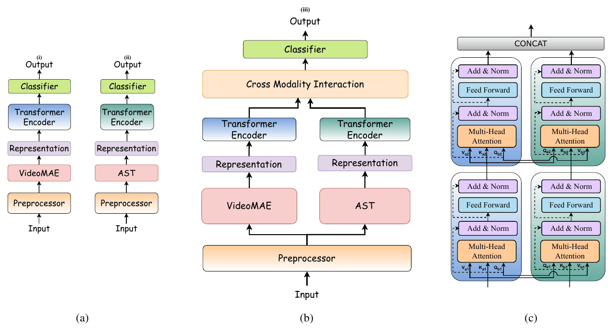

# SNIFR: Boosting Fine-Grained Child Harmful Content Detection Through Audio-Visual Alignment with Cascaded Cross-Transformer

**Orchid Chetia Phukan, Mohd Mujtaba Akhtar\*, Girish\*, Swarup Ranjan Behera, Abu Osama Siddiqui, Sarthak Jain, Priyabrata Mallick, Jaya Sai Kiran Patibandla, Pailla Balakrishna Reddy, Arun Balaji Buduru, Rajesh Sharma**
*INTERSPEECH 2025*
\* Equal contribution as second authors

[](https://arxiv.org/abs/2506.03378)


## Overview

Children watch more and more video online, and harmful material is sometimes hidden in only a few frames to slip past moderation. Earlier fine-grained detectors of child-harmful content use visual cues only. This paper shows that **audio is a complementary modality**: sound effects, background music and speech carry cues that the picture alone can miss.

**SNIFR** (Cros**S**-Modality I**N**teract**I**on Cascaded Trans**F**o**R**mer) aligns audio and visual representations in two steps:

<p align="center"></p>

1. **Intra-modality encoding:** AST (audio) and VideoMAE (visual) representations each pass through a transformer encoder (self-attention, feed-forward network, layer norm).
2. **Cascaded cross-transformer:** in each of two stages, queries come from one modality and keys/values from the other, followed by a feed-forward block:
   ```
   Z_A ← LN(Z_A + Attn(Q_A, K_B, V_B)),   Z_A ← LN(Z_A + FFN(Z_A))
   Z_B ← LN(Z_B + Attn(Q_B, K_A, V_A)),   Z_B ← LN(Z_B + FFN(Z_B))
   ```
3. The refined outputs are concatenated, `Z_fused = [Z_A⁽²⁾, Z_B⁽²⁾]`, and classified (dense layer of 120 units, softmax over **safe / sexual / violent / both**).

## Quick start

From the repository root:

```bash
pip install -r requirements.txt

python -m papers.snifr.train --synthetic                        # SNIFR on generated data (~1 min on CPU)
python -m papers.snifr.train --synthetic --model ct             # single cross-transformer stage
python -m papers.snifr.train --synthetic --model ec             # early concatenation (also: lc, ea, ep)
python -m papers.snifr.train --synthetic --model unimodal --stream video
```

## Running on the paper's dataset

**Data.** The paper uses the fine-grained dataset of Singh et al. (2019), available from its authors on request: 107,907 one-second clips labelled safe, sexual, violent or both. Audio is extracted from each clip with FFmpeg.

**1. Extract utterance-level embeddings** (768-d each; 16 kHz audio, video sampled at 16 frames per second):

```bash
python -m common.features.speech --model ast      --pool --inputs clips_audio.txt --out-dir data/fgchcd/audio
python -m common.features.video  --model videomae --pool --inputs clips_video.txt --out-dir data/fgchcd/video
```

**2. Write a manifest** with `subject_id,audio,video,label` (label: 0 safe, 1 sexual, 2 violent, 3 both). Use the source video as `subject_id`, so clips cut from the same video stay in one fold.

**3. Train and evaluate:**

```bash
python -m papers.snifr.train --manifest data/fgchcd/manifest.csv
```

The script reports class-wise accuracy, F1 and one-vs-rest AUC, and their averages.

## Published results

Results as reported in the paper (Table 1, %, average of five folds). Numbers from a rerun can vary slightly with feature extraction, data splits and random seeds. Each cell is ACC / F1 / AUC.

| Model | Safe | Sexual | Violent | Both |
|---|---|---|---|---|
| Visual only | 85.45 / 89.48 / 90.55 | 90.70 / 73.68 / 95.37 | 66.18 / 56.96 / 87.63 | 64.71 / 64.08 / 91.49 |
| Audio only | 71.27 / 80.29 / 77.92 | 83.33 / 58.82 / 82.87 | 46.48 / 35.11 / 74.81 | 50.00 / 27.91 / 78.58 |
| AV, early concatenation | 87.19 / 87.85 / 88.93 | 72.73 / 71.91 / 96.58 | 58.88 / 61.17 / 87.01 | 48.48 / 40.51 / 89.10 |
| AV, late concatenation | 82.29 / 84.40 / 85.62 | 85.71 / 75.00 / 91.06 | 58.25 / 56.34 / 83.85 | 60.00 / 57.14 / 92.95 |
| AV, element-wise average | 79.91 / 84.99 / 86.67 | 81.48 / 60.27 / 88.13 | 53.42 / 46.43 / 85.38 | 53.85 / 46.67 / 89.09 |
| AV, element-wise product | 78.33 / 81.23 / 83.60 | 70.59 / 58.54 / 95.28 | 45.45 / 44.55 / 81.15 | 51.66 / 45.36 / 88.29 |
| AV, single cross-transformer | 84.65 / 87.92 / 90.62 | 81.25 / 71.23 / 96.83 | 66.02 / 65.38 / 89.83 | 79.07 / 64.76 / 95.34 |
| **AV, SNIFR** | **88.24 / 91.49 / 95.28** | **93.33 / 82.11 / 98.72** | **84.15 / 77.09 / 96.19** | **79.59 / 75.73 / 97.82** |
| Previous SOTA (visual only), AUC | 88.00 | 95.00 | 90.00 | 91.00 |

## Implementation notes

| Component | Setting |
|---|---|
| Inputs | AST and VideoMAE embeddings average-pooled to 768-d vectors, as in the paper. Frame-level `(frames, 768)` inputs also work |
| Tokens | A pooled 768-d vector is read as 12 tokens of 64 features, projected to d_model = 256, with learned positional embeddings |
| Encoders | One transformer encoder layer per modality (4 heads, feed-forward 512) |
| Cross-transformer | Two stages; each stage updates both modalities from the previous stage's outputs |
| Pooling | Mean over tokens of each modality before concatenation |
| Baselines | EC / LC (dense 128 per modality) / EA / EP / single cross-transformer stage, and the unimodal models, all with the same classifier |
| Class-wise accuracy | Recall of each class; the averages are means over the four classes |
| Training | AdamW, lr 1e-4, weight decay 1e-5, batch 16, 25 epochs, dropout, early stopping |

## Files

| File | Contents |
|---|---|
| [`model.py`](model.py) | SNIFR, the fusion baselines and the unimodal model |
| [`train.py`](train.py) | 5-fold CV with class-wise metrics |
| [`configs/snifr.yaml`](configs/snifr.yaml) | Hyperparameters, with paper values marked |

## Citation

```bibtex
@inproceedings{phukan2025snifr,
  title     = {{SNIFR}: Boosting Fine-Grained Child Harmful Content Detection Through Audio-Visual Alignment with Cascaded Cross-Transformer},
  author    = {Phukan, Orchid Chetia and Akhtar, Mohd Mujtaba and Girish and Behera, Swarup Ranjan and Siddiqui, Abu Osama and Jain, Sarthak and Mallick, Priyabrata and Patibandla, Jaya Sai Kiran and Reddy, Pailla Balakrishna and Buduru, Arun Balaji and Sharma, Rajesh},
  booktitle = {Proc. Interspeech 2025},
  year      = {2025},
  eprint    = {2506.03378},
  archivePrefix = {arXiv}
}
```

## Ethics

SNIFR is a content-moderation research tool meant to protect children from harmful media. The dataset is available only from its original authors under their access conditions; no clips are distributed with this repository. Automatic moderation decisions should be reviewed by people.
