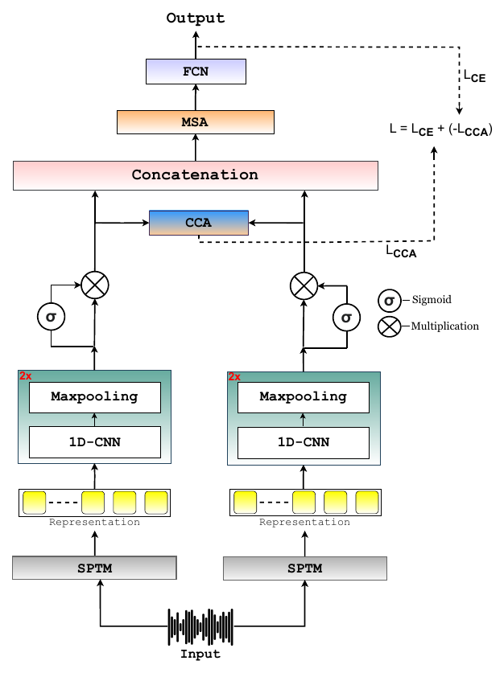

# Source Tracing of Synthetic Speech Systems Through Paralinguistic Pre-Trained Representations

**Girish\*, Mohd Mujtaba Akhtar\*, Orchid Chetia Phukan\*, Drishti Singh\*, Swarup Ranjan Behera, Pailla Balakrishna Reddy, Arun Balaji Buduru, Rajesh Sharma**
*EUSIPCO 2025*
\* Equal contribution

[](https://arxiv.org/abs/2506.01157)


## Overview

Source tracing of synthetic speech generation systems (STSGS) asks **which TTS or voice-conversion system produced a fake utterance**. The paper compares ten speech pre-trained models (SPTMs) and finds that a **paralinguistic** model, TRILLsson, gives the best single representation: source systems leave traces in prosody and voice quality as much as in content.

**TRIO** (Ga**T**ed Canonical Cor**R**elat**IO**n Attention Network) fuses two SPTMs:

<p align="center"></p>

1. Each SPTM embedding passes through two conv blocks (Conv1d with 128 and 64 filters, kernel 3, max-pool) and is flattened (`X`, `Y`).
2. **Sigmoid gates** weight the features adaptively: `X̂ = G_X ⊙ X`, `Ŷ = G_Y ⊙ Y`.
3. A **canonical correlation (CCA) loss** maximises the correlation between the gated views.
4. The views are concatenated, refined by **self-attention**, and classified by dense layers of 90 and 45 units.

```
L = L_CE − λ · L_CCA,      L_CCA = tr( Σ_X̂X̂^(−1/2) Σ_X̂Ŷ Σ_ŶŶ^(−1/2) ),      λ = 0.3
```

## Quick start

From the repository root:

```bash
pip install -r requirements.txt

python -m papers.trio.train --synthetic                         # TRIO on generated data
python -m papers.trio.train --synthetic --model concat          # concatenation fusion
python -m papers.trio.train --synthetic --model cnn --stream fm2    # one SPTM, CNN head
```

## Running on the paper's datasets

**Datasets.** **ASVspoof 2019 LA** with train, dev and eval merged into 19 source classes (A01–A19), evaluated with 5-fold cross-validation; and **CFAD** (Chinese, 12 synthesis systems) with its official split.

**1. Extract utterance-level embeddings:**

```bash
python -m common.features.speech --model xvector --pool --inputs asv19.txt --out-dir data/asv19/xvector
python -m common.features.speech --model trillsson --pool --inputs asv19.txt --out-dir data/asv19/trillsson
```

Also supported: `ecapa`, `wav2vec2`, `wavlm`, `unispeech_sat`, `xlsr_300m`, `whisper`, `mms`.

**2. Write a manifest** with `subject_id,fm1,fm2,label` (label = source system); add `split` (`train` / `dev` / `test`) for CFAD.

**3. Train and evaluate.** Set the feature sizes in [`configs/trio.yaml`](configs/trio.yaml) (x-vector 512, ECAPA 192, TRILLsson 1024), then:

```bash
python -m papers.trio.train --manifest data/asv19/manifest.csv                                  # 5-fold CV
python -m papers.trio.train --manifest data/cfad/manifest.csv --protocol official --set num_classes=12
```

## Published results

Results as reported in the paper (accuracy / one-vs-all EER averaged over classes, %). Numbers from a rerun can vary slightly with feature extraction, data splits and random seeds.

**Best single representation, TRILLsson (Table I):**

| Head | ASVspoof 2019 | CFAD |
|---|---|---|
| FCN | 92.53 / 4.79 | 78.91 / 8.63 |
| CNN | 97.16 / 1.69 | 92.81 / 3.37 |

**Fusion (Table II), selected pairs:**

| Pair | ASV: Concat | **ASV: TRIO** | CFAD: Concat | **CFAD: TRIO** |
|---|---|---|---|---|
| **x-vector + TRILLsson** | 98.38 / 0.36 | **99.56 / 0.19** | 97.28 / 1.29 | **99.04 / 0.95** |
| Wav2vec2-emo + TRILLsson | 97.39 / 0.45 | 97.56 / 0.39 | 96.38 / 1.49 | 97.16 / 0.99 |
| MMS + TRILLsson | 97.17 / 2.84 | 98.21 / 2.72 | 93.86 / 3.53 | 94.28 / 3.01 |

The previous best source-tracing result reported on the same data was 98.91 / 0.26 on ASVspoof 2019 and 99.01 / 1.07 on CFAD.

## Implementation notes

| Component | Setting |
|---|---|
| Inputs | Utterance-level embeddings, read as a one-channel sequence by the 1-D convolutions |
| Gates | Element-wise sigmoid gates computed by a 1×1 convolution over the conv feature map (one gate per flattened feature) |
| CCA loss | On learned 16-d projections of the gated views, with ridge-regularised covariances (ε = 1e-3), so it is well defined for batches of 32 |
| Self-attention | 4 heads over the concatenated feature-map positions, with a residual connection and layer norm |
| Concatenation baseline | Same network without gates, CCA loss and self-attention |
| Training | Adam, lr 1e-3, batch 32, 50 epochs, dropout, early stopping (10% of training speakers held out in CV) |

## Files

| File | Contents |
|---|---|
| [`model.py`](model.py) | TRIO model and loss |
| [`train.py`](train.py) | 5-fold CV / official-split training for TRIO and the baselines |
| [`configs/trio.yaml`](configs/trio.yaml) | Hyperparameters, with paper values marked |
| [`../../common/divergences.py`](../../common/divergences.py) | CCA objective |

## Citation

```bibtex
@inproceedings{girish2025sourcetracing,
  title     = {Source Tracing of Synthetic Speech Systems Through Paralinguistic Pre-Trained Representations},
  author    = {Girish and Akhtar, Mohd Mujtaba and Phukan, Orchid Chetia and Singh, Drishti and Behera, Swarup Ranjan and Reddy, Pailla Balakrishna and Buduru, Arun Balaji and Sharma, Rajesh},
  booktitle = {33rd European Signal Processing Conference (EUSIPCO)},
  year      = {2025},
  pages     = {496--500},
  eprint    = {2506.01157},
  archivePrefix = {arXiv}
}
```
